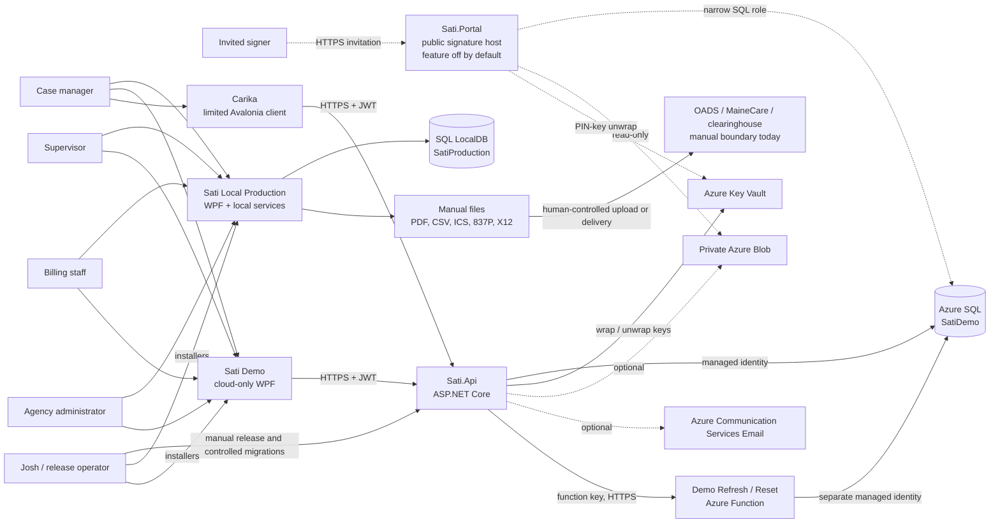
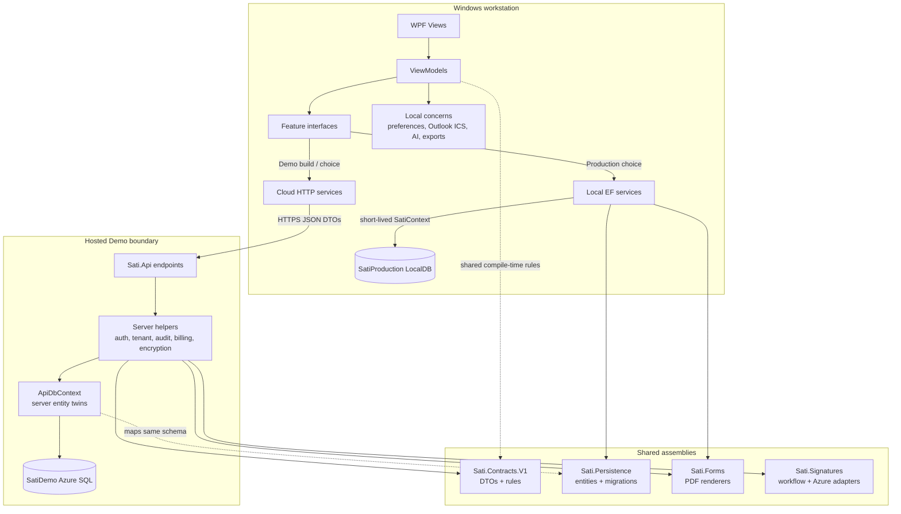
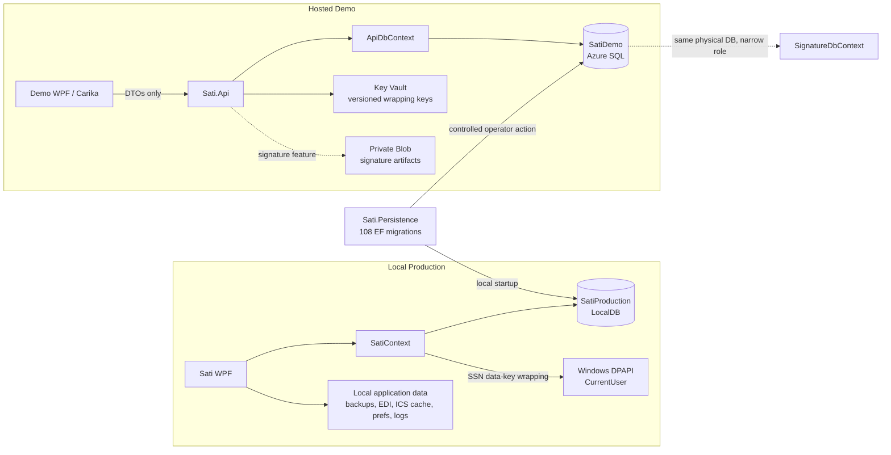
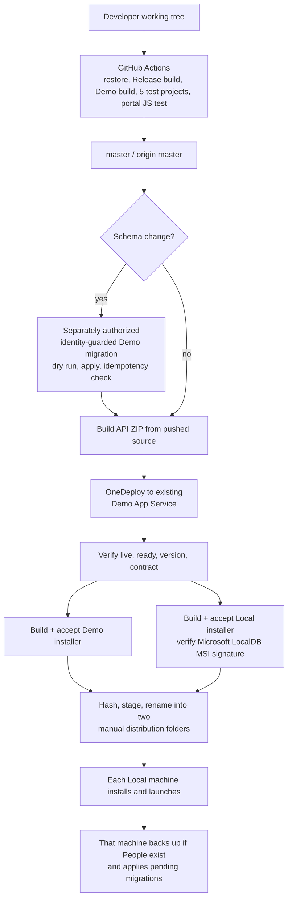
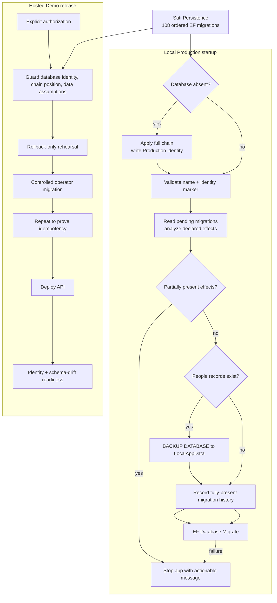
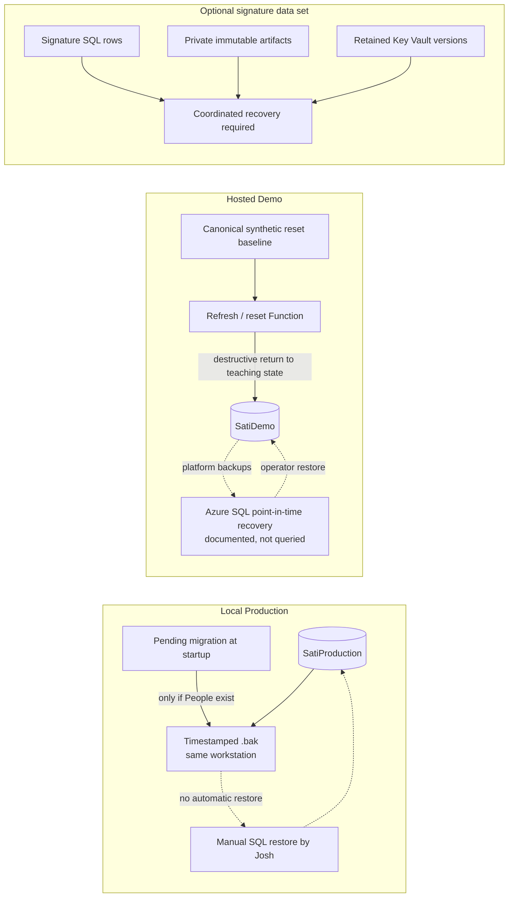
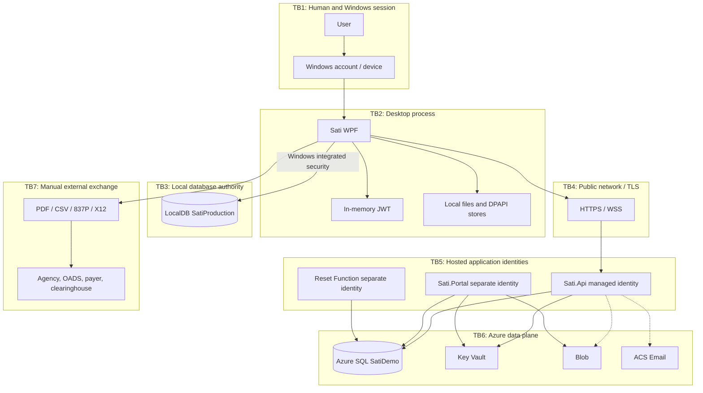
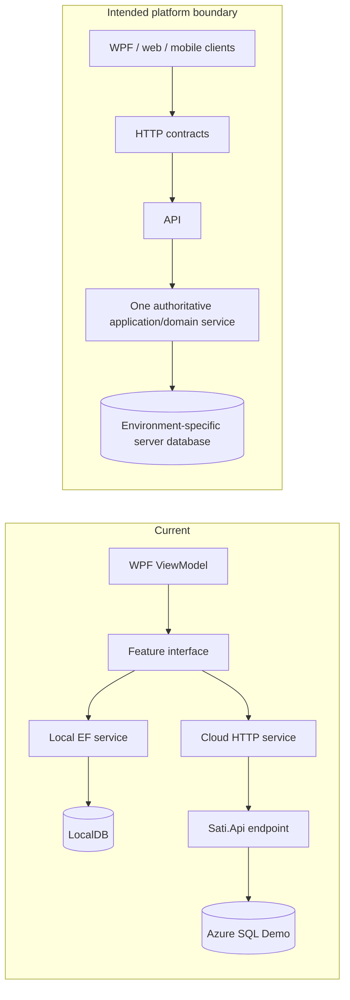

# Sati System Map

**Repository snapshot:** `master` at `871e209`, inspected 2026-09-15  
**Purpose:** a repository-grounded map of what Sati actually is, where data and authority live, and which operational claims cannot be proved from source alone.

## How to read this map

Every material statement uses one of these confidence labels:

- **VERIFIED** — established directly from current source, project files, tests, scripts, or configuration tracked in this repository.
- **INFERRED** — a strong architectural conclusion from the verified implementation, but not an independently observed runtime fact.
- **DOCUMENTED, NOT VERIFIED** — recorded in an operational document such as `AGENDA.md`, but this inspection did not query Azure, a workstation database, a distribution folder, or a running service.
- **UNESTABLISHED** — the repository does not supply enough evidence to make the claim.

Line references describe the inspected snapshot and will drift as files change. The existing documents are useful evidence, but current code wins when they disagree. In particular, older descriptions of the Demo reset are stale; see [Documentation disagreements](#documentation-disagreements).

## Architecture in one paragraph

Sati currently has **two materially different runtime architectures**. Local Production is a per-Windows-user WPF application that authenticates against and writes directly to a `SatiProduction` SQL Server LocalDB database using Windows integrated security. Hosted Demo is a cloud-only build of the same WPF application—and, separately, the small Avalonia client Carika—that talks over HTTPS to `Sati.Api`; the API authenticates users, revalidates the actor and tenant on every protected request, applies business rules, and reaches Azure SQL `SatiDemo` with its managed identity. Both paths share contracts and important rules, but they do **not** yet share one authoritative application-service implementation. `Sati.Persistence` owns the entity model and 108-migration chain; local service implementations still live in the desktop project, while the API has server-side entity twins and endpoint logic. **VERIFIED:** [`App.xaml.cs:36-143`](App.xaml.cs#L36-L143), [`App.xaml.cs:253-302`](App.xaml.cs#L253-L302), [`Data/DataEnvironment.cs:25-64`](Data/DataEnvironment.cs#L25-L64), [`Sati.Api/Endpoints/ApiEndpoints.cs:24-58`](Sati.Api/Endpoints/ApiEndpoints.cs#L24-L58), [`Sati.Persistence/Data/SatiContext.cs:15-78`](Sati.Persistence/Data/SatiContext.cs#L15-L78).

## 1. System context



**What exists:** Local WPF, cloud Demo WPF, API, Azure Demo database, Carika, local and cloud persistence, PDF/file generation, and the reset Function all have source in this repository. **VERIFIED:** [`SatiLogica.slnx:1-18`](SatiLogica.slnx#L1-L18), [`appsettings.Public.json:1-14`](appsettings.Public.json#L1-L14), [`scripts/Publish-DemoRefresh.ps1:1-61`](scripts/Publish-DemoRefresh.ps1#L1-L61).

**What is not a current integration:** generated 837P, OADS forms, and other exports cross the application boundary as files handled by a person. The repository contains no real MIHMS, OADS, SFTP, or production clearinghouse transport. The “mock clearinghouse” is deliberately synthetic and Demo/test-only. **VERIFIED:** [`Data/Billing/IdeService.cs:52-89`](Data/Billing/IdeService.cs#L52-L89), [`Sati.Api/Infrastructure/ClaimResponseIngestion.cs:27-46`](Sati.Api/Infrastructure/ClaimResponseIngestion.cs#L27-L46), [`Sati.Api/Endpoints/ApiEndpoints.cs:6602-6612`](Sati.Api/Endpoints/ApiEndpoints.cs#L6602-L6612).

## 2. Projects, executables, and libraries

| Component | Runtime role | Owns / is allowed to do | Must not be mistaken for |
|---|---|---|---|
| Root `Sati.csproj` | .NET 10 Windows WPF desktop | UI, ViewModels, local-only concerns, transitional Local Production EF services, cloud HTTP adapters | One uniform deployment: `Demo` compilation defines `SATI_DEMO`, renames the executable, and removes the local environment choice. **VERIFIED:** [`Sati.csproj:6-22`](Sati.csproj#L6-L22), [`App.xaml.cs:46-59`](App.xaml.cs#L46-L59) |
| `Sati.Api` | ASP.NET Core host | Cloud authentication, tenant authorization, validation, transactions, audit calls, Demo SQL access, health checks, optional signature workers | A migrator: the host detects schema drift but intentionally does not migrate. **VERIFIED:** [`Sati.Api/Program.cs:125-189`](Sati.Api/Program.cs#L125-L189), [`Sati.Api/Infrastructure/SchemaDriftHealthCheck.cs:13-26`](Sati.Api/Infrastructure/SchemaDriftHealthCheck.cs#L13-L26) |
| `Sati.Contracts` | Platform-neutral shared library | DTOs and authoritative rules used on both sides, including note/billing/session/tenant decisions and envelope protection | A database entity assembly or network host. **VERIFIED:** project references in [`Sati.Api/Sati.Api.csproj:21-24`](Sati.Api/Sati.Api.csproj#L21-L24) and [`Sati.Persistence/Sati.Persistence.csproj:9-18`](Sati.Persistence/Sati.Persistence.csproj#L9-L18) |
| `Sati.Persistence` | Platform-neutral EF persistence library | Canonical entity model, `SatiContext`, mappings, and the 108-migration chain | The only runtime DbContext: the API has a server-side mapped context of its own. **VERIFIED:** [`Sati.Persistence/Data/SatiContext.cs:9-78`](Sati.Persistence/Data/SatiContext.cs#L9-L78), [`Sati.Api/Data/ApiDbContext.cs:9-75`](Sati.Api/Data/ApiDbContext.cs#L9-L75) |
| `Sati.Forms` | PDF/form renderer library | Embedded official PDF assets and deterministic document generation | Regulatory approval or electronic submission. **VERIFIED:** [`Sati.Forms/Sati.Forms.csproj:3-22`](Sati.Forms/Sati.Forms.csproj#L3-L22) |
| `Sati.Signatures` | Shared signature workflow/infrastructure | Frozen document, token/PIN, package, outbox, Blob/Key Vault/ACS adapters | Evidence that a portal is deployed or approved for real signatures. **VERIFIED:** [`Sati.Signatures/SignatureInfrastructure.cs:7-28`](Sati.Signatures/SignatureInfrastructure.cs#L7-L28) |
| `Sati.Portal` | Separate ASP.NET Core public signer host | Narrow signature-only workflow, secure cookie, anti-forgery, rate limits, narrow SQL model | A staff API or deployed Production capability. It is disabled by default and refuses Production. **VERIFIED:** [`Sati.Portal/appsettings.json:1-5`](Sati.Portal/appsettings.json#L1-L5), [`Sati.Portal/Program.cs:27-93`](Sati.Portal/Program.cs#L27-L93), [`Sati.Portal/README.md:1-22`](Sati.Portal/README.md#L1-L22) |
| `Carika` | Limited Avalonia Windows client | Login, caseload/note interaction, encrypted local drafts, local Whisper transcription | A full mobile/offline Sati client. **VERIFIED:** [`Carika/Carika.csproj:4-19`](Carika/Carika.csproj#L4-L19), [`Carika/Services/EncryptedDraftStore.cs:6-31`](Carika/Services/EncryptedDraftStore.cs#L6-L31), [`Carika/Services/LocalWhisperTranscriber.cs:6-17`](Carika/Services/LocalWhisperTranscriber.cs#L6-L17) |
| `Sati.DemoRefresh` | PowerShell Azure Function | Scheduled rolling-date refresh and protected full reset of synthetic Demo | A Production job or backup system. **VERIFIED:** [`Sati.DemoRefresh/RefreshCaseload/function.json:1-12`](Sati.DemoRefresh/RefreshCaseload/function.json#L1-L12), [`Sati.DemoRefresh/ResetDemo/function.json:1-17`](Sati.DemoRefresh/ResetDemo/function.json#L1-L17) |
| `installer/` | IExpress-based packaging | Per-user Demo installer; Local installer with self-contained app and Microsoft-signed LocalDB MSI | A signed Sati installer. The generated installer itself is not code-signed. **VERIFIED:** [`installer/README.md:66-76`](installer/README.md#L66-L76), [`installer/Build-LocalInstaller.ps1:24-30`](installer/Build-LocalInstaller.ps1#L24-L30) |
| Five `.Tests` projects | Automated evidence | Desktop/domain, API integration, signatures, portal, and Carika tests | Proof of a live deployment, restored backup, or regulatory compliance. **VERIFIED:** [`SatiLogica.slnx:1-18`](SatiLogica.slnx#L1-L18) |

`tools/BrochureBackdrop` and `tools/Decompile` are repository utilities, not Sati runtime containers. The installer and Function sources are not solution projects, so a successful solution build alone does not validate them. **VERIFIED:** compare [`SatiLogica.slnx:1-18`](SatiLogica.slnx#L1-L18) with the repository directories.

## 3. Container and code-boundary view



The intended cloud seam is real: ViewModels depend on feature interfaces, and every Demo data interface is registered to a `Cloud*` adapter with no EF fallback. Local Production deliberately registers the direct services and `SatiContext`. **VERIFIED:** [`App.xaml.cs:469-529`](App.xaml.cs#L469-L529), [`App.xaml.cs:529-584`](App.xaml.cs#L529-L584).

The remaining duplication is also real. Local services and API endpoints separately orchestrate equivalent persistence workflows. Shared rule owners reduce disagreement, but there are still two application-service implementations to keep aligned. **INFERRED from verified code:** compare local note logic in [`Data/NoteService.cs:12-125`](Data/NoteService.cs#L12-L125) with cloud note logic in [`Sati.Api/Endpoints/ApiEndpoints.cs:4710-4859`](Sati.Api/Endpoints/ApiEndpoints.cs#L4710-L4859).

## 4. Runtime environments

| Concern | Local Production | Hosted Demo | Signature portal |
|---|---|---|---|
| Entry point | `Sati.exe`, user chooses “My work” | `Sati.Demo.exe` is compile-time cloud-only; developer WPF may choose Demo | Separate ASP.NET host, disabled by default |
| Data path | WPF → EF service → `SatiContext` → LocalDB | WPF or Carika → HTTPS API → `ApiDbContext` → Azure SQL | Browser → portal → `SignatureDbContext` → narrow signature tables in the same Demo database |
| Database identity | `SatiProduction` / `Production` | `SatiDemo` / `Demo` | Only `Demo/SatiDemo` or isolated tests; Production refused |
| Database credential | Windows integrated security in a local, gitignored connection string | Never in desktop; API setting uses managed identity according to operations records | Intended separate managed identity and SQL role |
| Schema owner today | Desktop startup applies pending EF migrations | Human-controlled deployment operation; API only detects drift | Same hosted schema; no portal migration path |
| Data classification | Real working data can be present | Synthetic-only by design | Synthetic-only feature gate |
| Live state confidence | Database contents/version are machine-specific and not inspected | Deployment details are **DOCUMENTED, NOT VERIFIED** | Deployment is **UNESTABLISHED** |

The chooser happens before database access, and both the configured database name and `dbo.SatiDatabaseIdentity` are checked before login or migrations. **VERIFIED:** [`App.xaml.cs:46-93`](App.xaml.cs#L46-L93), [`Data/DataEnvironment.cs:31-64`](Data/DataEnvironment.cs#L31-L64), [`Data/DataEnvironment.cs:67-104`](Data/DataEnvironment.cs#L67-L104).

## 5. Data architecture



### Authoritative relational data

`SatiContext` and `ApiDbContext` map the same broad schema. Important groups are:

| Data group | Representative tables / entities | Authority and protection |
|---|---|---|
| Identity and tenancy | `Agencies`, `Users`, `People`, `SatiDatabaseIdentity` | User has an `AgencyId`; clinical and workflow rows also carry tenant ownership. Tokens bind user, agency, security version, and Demo database instance. |
| Clinical/case work | `Notes`, `Forms`, `FormAttestations`, `ComprehensiveAssessments`, `SafetyPlans`, reviews, appointments, contacts, providers | Mutable drafts plus workflow locks, revisions, and scoped access. Submitted records are not universally represented as a separate immutable note-version table. |
| Documents/releases/signatures | `DocumentArtifacts`, templates, acknowledgments, release obligations/events, frozen signature documents, requests/sessions/consents/events/completions/packages/outbox | Several record types have append-only guards; signature rows share `SatiDemo` but the public portal is intended to receive a narrow SQL role. |
| Billing | settings/policy versions, recovery decisions, periods, claim lines, immutable EDI generations, submission events, encrypted clearinghouse receipts/matches, remittance outcomes/deposits | Billing permission plus agency scope; generation and response import use idempotency and transactions. |
| Oversight | `AuditEvents`, `PersonVersions`, incidents, legal holds, chat | Audit/person versions are append-only through EF change guards; a database principal with direct write power can bypass an application-only guard. |

**VERIFIED:** entity inventory in [`Sati.Persistence/Data/SatiContext.cs:15-78`](Sati.Persistence/Data/SatiContext.cs#L15-L78) and server mapping in [`Sati.Api/Data/ApiDbContext.cs:11-75`](Sati.Api/Data/ApiDbContext.cs#L11-L75). Append-only guards exist in both contexts: [`Sati.Persistence/Data/SatiContext.cs:99-147`](Sati.Persistence/Data/SatiContext.cs#L99-L147), [`Sati.Api/Data/ApiDbContext.cs:751-800`](Sati.Api/Data/ApiDbContext.cs#L751-L800).

### Device-local supporting stores

These are outside the relational backup boundary:

| Store | Contents and protection | Architectural consequence |
|---|---|---|
| `%LOCALAPPDATA%\Sati\schema-backups` | LocalDB pre-migration `.bak` files | Recovery copies are on the same workstation and are not a scheduled backup program. **VERIFIED:** [`Data/SqlLocalDatabaseMaintenance.cs:18-27`](Data/SqlLocalDatabaseMaintenance.cs#L18-L27) |
| `%LOCALAPPDATA%\Sati\EDI` and `%LOCALAPPDATA%\SatiLogica\Sati Demo\EDI` | Local and Demo 837P text files | A file containing billing information leaves database controls and must be handled manually. **VERIFIED:** [`Data/Billing/IdeService.cs:17-20`](Data/Billing/IdeService.cs#L17-L20), [`Data/Cloud/CloudUnavailableServices.cs:709-727`](Data/Cloud/CloudUnavailableServices.cs#L709-L727) |
| `%LOCALAPPDATA%\Sati\outlook-calendar-cache.dat` | Imported ICS overlay, DPAPI CurrentUser encrypted; never uploaded | Losing or recreating the Windows profile can make it unreadable; it is not authoritative Sati data. **VERIFIED:** [`Services/OutlookCalendarService.cs:46-73`](Services/OutlookCalendarService.cs#L46-L73) |
| `%LOCALAPPDATA%\Sati\Carika\Drafts` | Carika PHI drafts encrypted with DPAPI and bound to user/person | Offline draft recovery depends on that Windows account/profile. **VERIFIED:** [`Carika/Services/EncryptedDraftStore.cs:6-31`](Carika/Services/EncryptedDraftStore.cs#L6-L31) |
| `%LOCALAPPDATA%\Sati\LocalAi` | Foundry Local logs/model cache; first use may download a multi-GB model | The inference text is local, but model catalog/download is an external dependency on first use. **VERIFIED:** [`Services/LocalAi/FoundryLocalCaseNoteFormatter.cs:290-321`](Services/LocalAi/FoundryLocalCaseNoteFormatter.cs#L290-L321), [`Services/LocalAi/FoundryLocalCaseNoteFormatter.cs:342-348`](Services/LocalAi/FoundryLocalCaseNoteFormatter.cs#L342-L348) |
| User-selected paths | Generated PDFs, CSVs, imported/exported X12, and other documents | Sati cannot enforce retention, access, transmission, or deletion once the user saves or sends the file. **INFERRED** |

Uninstallers remove the per-user program folder, shortcuts, and uninstall registration. They do not remove the LocalDB database or the other application-data folders listed above. **VERIFIED/INFERRED:** exact removal target in [`installer/Uninstall-SatiLocal.ps1:16-63`](installer/Uninstall-SatiLocal.ps1#L16-L63).

### Sensitive-field protection

SSNs and clearinghouse response bodies use per-record AES-256-GCM data keys, authenticated to agency/record/field. The data key is wrapped either by Windows DPAPI for Local Production or a versioned Key Vault key for the API. Ordinary cloud reads return masks; plaintext is intended to exist only in narrow server-side form-fill paths. **VERIFIED:** [`Sati.Contracts/V1/EnvelopeProtection.cs:32-69`](Sati.Contracts/V1/EnvelopeProtection.cs#L32-L69), [`Sati.Contracts/V1/EnvelopeProtection.cs:91-168`](Sati.Contracts/V1/EnvelopeProtection.cs#L91-L168), [`Data/DpapiKeyWrapper.cs:8-25`](Data/DpapiKeyWrapper.cs#L8-L25), [`Sati.Api/Program.cs:106-123`](Sati.Api/Program.cs#L106-L123).

## 6. Authentication, authorization, and tenant isolation

```mermaid
sequenceDiagram
    actor User
    participant Client as Demo WPF / Carika
    participant Login as POST /api/v1/auth/login
    participant DB as SatiDemo Users + Identity
    participant JWT as TokenIssuer
    participant Filter as ValidatedActorFilter
    participant Route as Feature endpoint

    User->>Client: username + password
    Client->>Login: HTTPS credentials
    Login->>DB: load exact username
    Login->>Login: PBKDF2-SHA256 100,000 iterations
    Note over Login: Fake derivation also runs for unknown username
    Login->>DB: re-check enabled, hash/salt, agency, role, permissions, security version
    Login->>DB: append authentication audit event
    Login->>DB: read Demo database InstanceId
    Login->>JWT: sign short-lived HMAC-SHA256 token
    JWT-->>Client: JWT + expiry + safe profile DTO
    Note over Client: token held in process memory
    Client->>Filter: Bearer JWT on protected request
    Filter->>DB: re-load user and current InstanceId
    Filter->>Filter: compare user id, enabled, agency, role, security version; install current DB permissions
    Filter->>Route: validated Actor
    Route->>DB: query with agency and caseload predicates
    DB-->>Route: in-scope data only
```

All `/api/v1` feature routes are grouped behind JWT authentication, `ValidatedActorFilter`, and `SingleAttemptWriteFilter`; only login is anonymous. The actor filter re-reads the database, so a signed token alone is not trusted for current role, permissions, security version, or reset instance. **VERIFIED:** [`Sati.Api/Endpoints/ApiEndpoints.cs:24-58`](Sati.Api/Endpoints/ApiEndpoints.cs#L24-L58), [`Sati.Api/Security/TenantAccess.cs:101-158`](Sati.Api/Security/TenantAccess.cs#L101-L158).

Authentication is local username/password authentication, not Microsoft Entra end-user authentication. Passwords are PBKDF2-SHA256 with a random 16-byte salt and 100,000 iterations. API login performs a fake derivation for a missing username to reduce username timing disclosure, audits success, and issues an HMAC-SHA256 JWT containing user, role, agency, security version, and Demo database instance claims. **VERIFIED:** [`Data/PasswordHasher.cs:8-46`](Data/PasswordHasher.cs#L8-L46), [`Sati.Api/Endpoints/ApiEndpoints.cs:1226-1295`](Sati.Api/Endpoints/ApiEndpoints.cs#L1226-L1295), [`Sati.Api/Security/TokenIssuer.cs:10-54`](Sati.Api/Security/TokenIssuer.cs#L10-L54).

Tenant isolation is **application-enforced**, not a database row-level-security policy. `TenantAccess` combines current user facts with explicit `AgencyId`, ownership, and supervisor/caseload rules; routes add their own tenant predicates. No `HasQueryFilter`, SQL RLS security policy, or equivalent global tenant filter was found. **VERIFIED for the mechanism; INFERRED for the architectural risk:** [`Sati.Api/Security/TenantAccess.cs:8-99`](Sati.Api/Security/TenantAccess.cs#L8-L99). A new route that forgets one of these checks can cross a tenant boundary even though other routes are correct.

Local Production repeats current-session, agency, ownership, and supervisory checks in `LocalTenantAccess`, but the same Windows user can connect to LocalDB outside Sati and bypass all application authorization. That is an inherent limit of the present local architecture. **VERIFIED/INFERRED:** [`Data/LocalTenantAccess.cs:7-108`](Data/LocalTenantAccess.cs#L7-L108), [`appsettings.template.json:8-10`](appsettings.template.json#L8-L10).

## 7. Critical workflow: create or update a case note

```mermaid
sequenceDiagram
    actor CM as Case manager
    participant VM as NoteEntryViewModel
    participant IF as INoteService
    participant Cloud as CloudNoteService
    participant API as Notes endpoint
    participant Gate as Shared note, billing, workflow rules
    participant Scope as ServiceTimeWriteScope
    participant DB as Notes / People / policy tables

    CM->>VM: enter client, date, type, narrative, time, status
    VM->>VM: presentation validation and explicit AI-draft acceptance if used
    VM->>IF: AddNoteAsync or UpdateNoteAsync
    alt Local Production
        IF->>DB: LocalTenantAccess + short-lived SatiContext
        IF->>Scope: serialize service-time write for agency/user
        IF->>Gate: normalize; compliance submission gate; overlap gate; workflow transition
        IF->>DB: save Note + local audit event; increment Revision on update
    else Hosted Demo
        IF->>Cloud: map entity to SaveNoteRequest DTO
        Cloud->>API: authenticated POST /notes or PUT /notes/{id}
        API->>Scope: serialize service-time write for agency/user
        API->>DB: verify current actor owns Person in same agency
        API->>Gate: normalize; compliance submission gate; overlap gate; workflow transition
        API->>DB: save ServerNote; update requires ExpectedRevision and increments Revision
    end
    DB-->>VM: stored note or typed validation/conflict response
```

The authoritative save path checks more than the ViewModel: tenant/caseload ownership, business-date normalization, required fields, billing-compliance submission conditions, overlapping service time, workflow transitions, and optimistic revision. A UI-only check is not the security or integrity boundary. **VERIFIED:** [`Sati.Api/Endpoints/ApiEndpoints.cs:4710-4859`](Sati.Api/Endpoints/ApiEndpoints.cs#L4710-L4859), [`Data/NoteService.cs:12-108`](Data/NoteService.cs#L12-L108).

Logged/approved notes are locked from ordinary case-manager editing; correction requires the workflow to return the note. Draft/deletable status rules prevent deleting workflow-controlled notes. **VERIFIED:** [`Sati.Api/Endpoints/ApiEndpoints.cs:4786-4798`](Sati.Api/Endpoints/ApiEndpoints.cs#L4786-L4798), [`Sati.Api/Endpoints/ApiEndpoints.cs:4862-4893`](Sati.Api/Endpoints/ApiEndpoints.cs#L4862-L4893).

Saving a logged note does **not** transmit a claim or send a record to an external party. It makes the note eligible for later review/billing processing. Claim lines and 837P generation are separate workflows. **VERIFIED/INFERRED.**

**Audit parity finding:** the local create/update path writes `NoteCreated`/`NoteUpdated` audit events. In the API path, ordinary create has no `AuditTrail` dependency or call, and ordinary update audits reassignment only. This inspection found no general cloud note-created or note-updated event at those endpoints. The row and revision are still persisted, and later workflow actions may be audited, but the two architectures do not presently have equivalent general note-change audit evidence. **VERIFIED:** [`Data/NoteService.cs:24-32`](Data/NoteService.cs#L24-L32), [`Data/NoteService.cs:102-121`](Data/NoteService.cs#L102-L121), [`Sati.Api/Endpoints/ApiEndpoints.cs:4710-4757`](Sati.Api/Endpoints/ApiEndpoints.cs#L4710-L4757), [`Sati.Api/Endpoints/ApiEndpoints.cs:4836-4853`](Sati.Api/Endpoints/ApiEndpoints.cs#L4836-L4853).

## 8. Consequential workflow: create an 837P and process a response

```mermaid
sequenceDiagram
    actor B as Billing user
    participant WPF as BillingSubmissionsViewModel
    participant API as Billing API
    participant DB as SatiDemo billing tables
    participant Disk as User LocalAppData
    participant Human as Human / external portal
    participant Mock as Demo mock clearinghouse

    B->>WPF: generate 837P for billing period
    WPF->>API: POST period/edi + isTest + idempotency key
    API->>DB: require current Billing actor and same-agency exportable period
    API->>DB: serializable write; create immutable EdiGeneration + Generated event + audit
    API-->>WPF: exact retained filename and content
    WPF->>Disk: save .txt under per-user EDI folder
    alt Real-world path today
        B->>Human: manually upload or transmit file outside Sati
        Human-->>B: obtain 999 / 277CA / 835 file
        B->>API: manual response import (currently Demo/test-only)
    else Demo teaching path
        B->>Mock: submit exact retained test generation
        Mock-->>API: fabricated 999 / 277CA / 835
    end
    API->>API: parse; require test interchange; match retained outbound evidence
    API->>DB: encrypt raw receipt; idempotently commit receipt, matches, outcomes, deposits, audit
```

Generation is server-authoritative in Demo and direct-service authoritative locally. It freezes the outbound content in `EdiGenerations`, records a `Generated` submission event and audit event, and uses an idempotency key so an uncertain client retry can return the same retained file rather than create a second generation. **VERIFIED:** [`Sati.Api/Endpoints/ApiEndpoints.cs:6531-6634`](Sati.Api/Endpoints/ApiEndpoints.cs#L6531-L6634), [`Data/Billing/IdeService.cs:28-114`](Data/Billing/IdeService.cs#L28-L114).

The application explicitly records that generation does not imply external transmission. A production-mode file can be generated, but the code shown here does not transmit it or prove payer acceptance. **VERIFIED:** [`Sati.Api/Endpoints/ApiEndpoints.cs:6602-6609`](Sati.Api/Endpoints/ApiEndpoints.cs#L6602-L6609).

Response intake is currently enabled only for `Demo/SatiDemo` or isolated tests, accepts test interchanges, matches against retained outbound evidence, envelope-encrypts the raw response, and commits all derived effects in one serializable transaction. The mock-clearinghouse “Transmitted” event is synthetic, not evidence of real delivery. **VERIFIED:** [`Sati.Api/Infrastructure/ClaimResponseIngestion.cs:19-101`](Sati.Api/Infrastructure/ClaimResponseIngestion.cs#L19-L101), [`Sati.Api/Endpoints/ApiEndpoints.cs:5969-6109`](Sati.Api/Endpoints/ApiEndpoints.cs#L5969-L6109).

## 9. Release and deployment architecture



GitHub Actions is a validation pipeline, not a deployment pipeline. It restores, builds Release and Demo, runs the solution tests, and runs the portal JavaScript test. **VERIFIED:** [`.github/workflows/build.yml:18-33`](.github/workflows/build.yml#L18-L33).

The release playbook is deliberately manual: verify source and version, run tests, push, separately migrate if required, build a ZIP from pushed source, OneDeploy to the existing Demo App Service, check health/version/contract, build and accept two installers, hash them, and copy them to named distribution folders without overwrite. **VERIFIED as process definition:** [`RELEASE_PLAYBOOK.md:147-229`](RELEASE_PLAYBOOK.md#L147-L229), [`RELEASE_PLAYBOOK.md:232-282`](RELEASE_PLAYBOOK.md#L232-L282). Whether each step happened for a particular release is operational evidence, not source proof.

There is no Terraform, Bicep, ARM template, or equivalent complete infrastructure-as-code definition in the repository. `Publish-DemoRefresh.ps1` can create its Storage account and Function App, but the main API, Azure SQL, Key Vault, network rules, alerting, and optional signature resources are not reproducibly described as one stack. **VERIFIED/INFERRED:** [`scripts/Publish-DemoRefresh.ps1:41-56`](scripts/Publish-DemoRefresh.ps1#L41-L56).

Current release records state that 1.3.11 source, API, migrations 106-108, and both installers were published and accepted. This inspection did not query those systems. **DOCUMENTED, NOT VERIFIED:** [`AGENDA.md:152-224`](AGENDA.md#L152-L224).

## 10. Migrations and data protection



The local provisioner touches only a genuinely absent database, applies the full chain, and then writes a `Production` identity marker. Existing databases must pass the ordinary identity gate. **VERIFIED:** [`Data/LocalDatabaseProvisioner.cs:6-54`](Data/LocalDatabaseProvisioner.cs#L6-L54).

For existing local databases, startup reads pending migrations, diagnoses fully or partially pre-existing effects, refuses ambiguous partial state, takes a backup when `People` rows exist, performs one legacy form repair at its exact historical point if needed, and then applies migrations. The application shuts down on failure or repair-needed state. **VERIFIED:** [`Data/LocalDatabaseUpdate.cs:159-191`](Data/LocalDatabaseUpdate.cs#L159-L191), [`Data/LocalDatabaseUpdate.cs:194-257`](Data/LocalDatabaseUpdate.cs#L194-L257), [`Data/LocalDatabaseUpdate.cs:260-331`](Data/LocalDatabaseUpdate.cs#L260-L331), [`App.xaml.cs:279-301`](App.xaml.cs#L279-L301).

Important limit: the ordinary startup backup command is `BACKUP DATABASE ... WITH INIT, SKIP, NOFORMAT`; it does **not** run `WITH CHECKSUM` or `RESTORE VERIFYONLY`, and the application does not automatically restore on migration failure. Some one-off release scripts have stronger checks, but those do not change the normal startup behavior. **VERIFIED:** [`Data/SqlLocalDatabaseMaintenance.cs:76-103`](Data/SqlLocalDatabaseMaintenance.cs#L76-L103).

The hosted API never calls `Migrate()`. Its readiness check reports model objects missing from the database; it is a detector, not a repair. A deployment with code ahead of schema can therefore become unready and feature requests can fail until the controlled migration is applied. **VERIFIED:** [`Sati.Api/Infrastructure/SchemaDriftHealthCheck.cs:13-42`](Sati.Api/Infrastructure/SchemaDriftHealthCheck.cs#L13-L42), [`Sati.Api/Infrastructure/SchemaDriftHealthCheck.cs:53-84`](Sati.Api/Infrastructure/SchemaDriftHealthCheck.cs#L53-L84).

## 11. Backup, recovery, and disaster recovery



### What can actually be said

- **VERIFIED:** local pre-migration backups exist as a safety gate when a database with `People` has pending migrations. They are stored on the same workstation. There is no repository implementation of scheduled local backup, off-device replication, rotation, restore UI, or restore drill.
- **DOCUMENTED, NOT VERIFIED:** Azure SQL `SatiDemo` has point-in-time recovery, and releases have relied on it before guarded migrations. The repository does not contain the current retention configuration or a performed restore result. See [`DATABASE_ENVIRONMENTS.md:286-288`](DATABASE_ENVIRONMENTS.md#L286-L288).
- **VERIFIED:** the Demo baseline reset is **not a backup**. It intentionally destroys post-baseline synthetic activity and returns the Demo to a canonical teaching state. It must never be used for Production.
- **UNESTABLISHED:** recovery time objective, recovery point objective, geo-redundancy, production-cloud backup design, automated restore validation, and a tested whole-system disaster recovery procedure.
- **UNESTABLISHED:** coordinated restoration of signature SQL rows, Blob artifacts, Key Vault key versions, portal data-protection keys, and mail state. The operations document itself lists recovery/retention work as a prerequisite. [`OPERATIONS.md:352-379`](OPERATIONS.md#L352-L379).

## 12. Trust boundaries



| Boundary | Data crossing | Main control | Main failure mode |
|---|---|---|---|
| Human → Windows/device | credentials, PHI, files | Windows account, application login, idle/session controls | Shared/compromised Windows profile exposes local app, files, DPAPI access, and LocalDB authority |
| WPF → LocalDB | full Production records | integrated security, `LocalTenantAccess`, database identity marker | Direct SQL under the same Windows user bypasses application authorization and audit |
| Demo client → API | credentials, JWT, synthetic case/billing data | HTTPS, token lifetime/renewal, server revalidation, DTO boundary | signing-key theft, endpoint authorization omission, stale/compromised client |
| API → Azure SQL | broad application data | managed identity, documented reader/writer role, tenant predicates | compromised API identity can write broadly; application append-only guards are not SQL denial rules |
| API/portal → Key Vault | data-key wrapping/unwrapping | managed identity and versioned key identifiers | deletion/loss of a required key version makes ciphertext unrecoverable |
| API/portal → Blob/ACS | frozen documents, signing links/email | feature gates, exact-host validation, separate intended identities | public-link leakage, resource misconfiguration, missing coordinated recovery |
| API → Reset Function | reset request, actor/request IDs, Function key | HTTPS, server-held key, Admin gate, Demo identity, SQL application lock | Function-key exposure or baseline/procedure error; no external failure receiver is documented as configured |
| Sati → manual file exchange | PHI/financial files | user-selected location, CSV neutralization where applicable, human procedure | loss, misdelivery, uncontrolled copies, or confusing “generated” with “submitted/accepted” |
| Source → build → installer/deployment | binaries and packages | Git history, tests, hashes, no-overwrite release ledger | manual process error; Sati installers are unsigned; infrastructure/config drift |

## 13. Demo reset topology

The source supports two Function entry points: a timer-triggered refresh and a separately authenticated HTTP full reset. The WPF Admin command calls an Administration-authorized API route only when the API is validated as Demo/test; the API sends a server-held Function key to the Function. API mutations and reset use a SQL application lock, and reset changes the database `InstanceId`, invalidating pre-reset JWTs. **VERIFIED:** [`Sati.Api/Endpoints/ApiEndpoints.cs:258-304`](Sati.Api/Endpoints/ApiEndpoints.cs#L258-L304), [`Sati.Api/Infrastructure/DemoResetCoordinator.cs:18-40`](Sati.Api/Infrastructure/DemoResetCoordinator.cs#L18-L40), [`Sati.Api/Infrastructure/DemoMutationLeaseMiddleware.cs:17-52`](Sati.Api/Infrastructure/DemoMutationLeaseMiddleware.cs#L17-L52), [`Sati.Api/Security/TenantAccess.cs:121-128`](Sati.Api/Security/TenantAccess.cs#L121-L128).

The latest release ledger says the full baseline, Function, API configuration, and destructive live acceptance were completed in release 1.3.4, including proof that the old token failed after reset. **DOCUMENTED, NOT VERIFIED:** [`AGENDA.md:1049-1065`](AGENDA.md#L1049-L1065), [`AGENDA.md:1084-1095`](AGENDA.md#L1084-L1095). It also says an external destination for reset-failure alerts remains unconfigured. That is the most current repository record of the operational state.

## 14. Electronic-signature topology

The signature implementation is substantial but separately gated:

1. An authorized staff API path freezes the exact document and stores hashes/metadata; workers can put private artifacts in Blob and protect PIN/outbox secrets with separate Key Vault keys.
2. An invitation reaches a separate public `Sati.Portal` host. The portal uses a narrow `SignatureDbContext`, rate limits, secure cookies, anti-forgery checks, a separate intended managed identity, read-only Blob access, and only PIN-key unwrap authority.
3. Completion is recorded append-only; an API worker can build the signed package and optionally send tightly restricted synthetic email through ACS.

The feature refuses Production and is disabled by default. Repository source is not evidence that the portal host, Blob container, Key Vault keys, ACS resource, SQL role, DNS/TLS, persistent ASP.NET data-protection key ring, monitoring, or legal approval currently exist. **VERIFIED/UNESTABLISHED:** [`Sati.Signatures/SignatureInfrastructure.cs:23-28`](Sati.Signatures/SignatureInfrastructure.cs#L23-L28), [`Sati.Portal/Program.cs:27-93`](Sati.Portal/Program.cs#L27-L93), [`Sati.Portal/README.md:13-22`](Sati.Portal/README.md#L13-L22), [`Sati.Portal/README.md:33-74`](Sati.Portal/README.md#L33-L74).

## 15. Observability and operational controls

- The API exposes anonymous `/health/live`, `/health/ready`, and `/health/version`. Readiness checks database identity and blocking schema drift. **VERIFIED:** [`Sati.Api/Program.cs:187-189`](Sati.Api/Program.cs#L187-L189), [`Sati.Api/Program.cs:244-260`](Sati.Api/Program.cs#L244-L260).
- API errors receive correlation IDs, safe generic responses, structured logs, and incident aggregation. The repository cannot prove log retention, alert routing, or operator response. **VERIFIED/UNESTABLISHED:** [`Sati.Api/Program.cs:193-214`](Sati.Api/Program.cs#L193-L214), [`OPERATIONS.md:129-146`](OPERATIONS.md#L129-L146).
- Local WPF has run-state/crash logging and a PHI-minimized incident outbox for cloud reports. These are supporting telemetry, not reportable client-incident management.
- The latest Demo-reset release record says Smart Detection has no receiver and there are no metric alerts for reset failure. **DOCUMENTED, NOT VERIFIED:** [`AGENDA.md:1063-1065`](AGENDA.md#L1063-L1065).
- No evidence establishes 24/7 monitoring, an on-call owner, external availability checks, or tested alert delivery.

## 16. Test and verification architecture

The solution contains five test projects: desktop/domain, API, signatures, portal, and Carika. API tests include isolated HTTP hosts and optional real SQL Server cases; structure and script tests protect release/reset assumptions. CI builds the Release and Demo variants and runs all solution tests plus the portal browser-side Node test. **VERIFIED:** [`SatiLogica.slnx:1-18`](SatiLogica.slnx#L1-L18), [`.github/workflows/build.yml:18-33`](.github/workflows/build.yml#L18-L33).

The 1.3.11 ledger records 2,156 desktop, 820 API, 119 signature, 8 portal, and 4 Carika tests passing, with opt-in SQL/external checks skipped and one non-reproduced unidentified API failure. Those are release records, not results rerun during this inspection. **DOCUMENTED, NOT VERIFIED:** [`AGENDA.md:179-184`](AGENDA.md#L179-L184).

Tests provide strong regression evidence but cannot prove current Azure settings, firewall closure, backups, restored data, external delivery, device versions, or organizational procedures.

## 17. Current architecture versus intended architecture



The cloud boundary is established for Demo, but Local Production remains a separate direct-EF product path. There is no Production cloud API/database deployment in this repository’s verified state, and moving real data to Azure is not authorized by Demo work. The next architectural consolidation is not “put an Azure connection string in WPF”; it is to move authoritative application services behind an API and make all distributed clients consume safe DTOs.

## 18. Documentation disagreements

| Disagreement | Repository conclusion |
|---|---|
| `AGENTS.md` says the nightly reset is not configured; `ARCHITECTURE.md:396-415`, `DECISIONS.md:95-106`, and the opening of `DATABASE_ENVIRONMENTS.md` describe the full reset as pending. | Those passages predate the later 1.3.4 ledger. Current source contains the reset path, and `AGENDA.md:1049-1095` records deployment and live acceptance. Treat the mechanism as **VERIFIED in source**, deployment as **DOCUMENTED, NOT VERIFIED**, and external failure alerting as still open. |
| `DATABASE_ENVIRONMENTS.md:319` still marks full-baseline restoration pending. | Stale checklist relative to the 1.3.4 ledger. Alert routing and independent current-state verification remain open. |
| Project briefing test counts are 136 desktop / 65 API. | Stale. Current solution has five test projects; the 1.3.11 ledger records much larger counts. |
| Some architectural prose says the API is authoritative for migrations. | That is the target ownership. Actual code makes Local WPF responsible for LocalDB migrations and a human-controlled release operation responsible for Azure migrations; `Sati.Api` only detects drift. |
| The 1.3.11 ledger says Local startup takes a “verified backup.” | Code proves that it takes a backup before migration, but the normal startup command does not checksum or restore-verify it. “Verified” is too strong for the general startup path. |

## What Josh Must Keep In His Head

1. Sati is currently two architectures: Local Production is WPF → LocalDB; Demo is client → API → Azure SQL.
2. The Demo executable cannot fall back to LocalDB, and distributed clients must never receive an Azure SQL credential.
3. `Sati.Contracts.V1` is where permission, workflow, billability, and record-status rules should have one owner.
4. `Sati.Persistence` owns the canonical model and migration chain; there are currently 108 migrations.
5. The API does not migrate Azure SQL. Schema changes and code deployment are separate, ordered release actions.
6. Every local workstation is its own Production deployment and database. Installing 1.3.11 elsewhere does not upgrade Josh’s or another user’s machine.
7. Local startup migrations are automatic, fail closed, and back up databases with `People` rows—but normal startup does not validate that backup by restoring it.
8. A Demo JWT is not trusted by itself: the API re-loads the user, permissions, security version, agency, and database instance on every protected request.
9. Tenant isolation is enforced by code predicates, not SQL RLS. Every new query/route must carry the tenant/caseload proof.
10. Local application authorization can be bypassed by someone who controls the same Windows account and connects directly to LocalDB.
11. Submitted/locked workflow state and `Revision` protect notes from ordinary overwrite, but not every clinical record has a complete immutable content-version history.
12. Cloud note create/update currently lacks the general audit events written by the equivalent local path.
13. Generating an 837P means only that Sati created and retained a file. It does not mean transmitted, accepted, adjudicated, or paid.
14. The mock clearinghouse and response intake are synthetic Demo/test capabilities, not a live payer connection.
15. PDF generation and form filling are not OADS submission, signature validity, regulatory approval, or proof of authorization.
16. SSN/response encryption depends on preserving the exact DPAPI profile or Key Vault key version that wrapped each row’s data key.
17. Demo reset is destructive synthetic-data recovery, not backup/DR, and not a Production capability.
18. The signature feature is implemented but disabled and synthetic-only; deployment and legal/operational readiness are not established.
19. Files saved outside Sati—PDF, CSV, ICS, X12, 837P—leave Sati’s database access, audit, retention, and backup controls.
20. Current installers are hash-recorded but not Sati code-signed; Windows can show Unknown publisher/SmartScreen warnings.
21. Health endpoints detect some failures; they do not prove anyone is being alerted or will respond.
22. A successful test suite is not evidence that a firewall rule is closed, a backup restores, every workstation is current, or a cloud resource has the intended permissions.
23. Demo and Production must remain separate in data, identity, credentials, service principals, deployments, logs, backups, and administration.
24. Sati is not presently established as HIPAA compliant or Production-cloud ready.

## Danger Zones

| Danger | Why it matters | Existing mitigation | Required next mitigation |
|---|---|---|---|
| **Possible open temporary Azure SQL firewall rule** | It can expose the SQL endpoint beyond the intended API/Function addresses. | Release process forbids Codex/release tooling from changing it. | Josh must verify and close the exact-IP rule immediately. **DOCUMENTED OPEN:** [`AGENDA.md:225-226`](AGENDA.md#L225-L226). |
| **Unknown Local Production fleet state** | Different machines can run different binaries and schemas against independent real datasets. | Startup identity/migration gate and pre-migration backup. | Install/launch 1.3.11 on each named machine and record version, migration head, backup path, and success. **DOCUMENTED OPEN:** [`AGENDA.md:228-236`](AGENDA.md#L228-L236). |
| **Cloud note audit parity gap** | Clinical change evidence differs by environment. | Revision checks, workflow locks, reassignment audit. | Add and regression-test general API note create/update audit events without logging narrative. Evidence above in [case-note workflow](#7-critical-workflow-create-or-update-a-case-note). |
| **Application-only tenant isolation** | One omitted route predicate can disclose or mutate another agency’s data. | JWT validation, per-request actor revalidation, `TenantAccess`, shared rules, authorization tests. | Require a route-level tenant checklist/test for every new endpoint; evaluate defense-in-depth SQL RLS or constrained data-access abstractions before real multi-tenant Production. |
| **Broad API SQL write authority** | EF append-only guards do not stop a compromised process or direct SQL statement. | Managed identity, no client credentials, documented `db_datareader`/`db_datawriter`, EF guards. | Apply table/procedure-level least privilege and explicit SQL denies for immutable records before real PHI cloud use; verify grants from live Azure. [`OPERATIONS.md:114-146`](OPERATIONS.md#L114-L146). |
| **LocalDB is inside the user trust boundary** | Same-profile compromise bypasses Sati login, tenant checks, and audit. | Windows account boundary, DPAPI for selected fields, app checks. | Treat disk/profile security, BitLocker, Windows access, device management, backup, and incident response as mandatory controls; do not call local app authentication a database security boundary. |
| **Backup is not a recovery program** | Same-device `.bak` files can disappear with device loss and have not been proven restorable by normal startup. | Fail-closed backup-before-migration. | Add off-device encrypted backups, retention, checksum/restore validation, restore drills, documented RPO/RTO, and a downtime procedure. |
| **Manual cloud migration/release chain** | Wrong ordering can put API code ahead of schema; manual settings and packages can drift. | identity guards, rollback rehearsal, idempotency repeat, readiness check, hashes, release ledger. | Automate a least-privilege migration runner and declarative infrastructure/config evidence while retaining explicit authorization gates. |
| **Encryption-key dependency** | Deleting a DPAPI profile or required Key Vault version permanently loses protected values. | Per-row versioned key IDs and fail-closed unconfigured providers. | Back up/recover Windows profiles appropriately; enable Key Vault soft delete/purge protection and test restoration with retained versions; document crypto-erasure decisions. |
| **Manual export boundary** | Billing/clinical files can be copied, emailed, misplaced, or retained indefinitely outside Sati. | safe filenames, some CSV formula neutralization, user-mediated action. | Define approved storage/transmission, minimum access, retention/destruction, receipt confirmation, and incident procedure before real organizational use. |
| **Unsigned Sati installers** | Users cannot strongly verify publisher identity through Windows trust UI. | Recorded SHA-256 and no-overwrite distribution process; embedded LocalDB MSI is Microsoft-signed. | Obtain a trusted code-signing certificate, sign installers/binaries, timestamp signatures, and verify in acceptance. [`installer/README.md:66-76`](installer/README.md#L66-L76). |
| **Demo reset alerting gap** | A failed nightly reset can leave a stale or partially useful teaching environment unnoticed. | transactional guards, schema-set comparison, locks, instance-token invalidation, recorded status. | Configure an external receiver and prove alert delivery. **DOCUMENTED OPEN:** [`AGENDA.md:1063-1065`](AGENDA.md#L1063-L1065). |
| **Signature implementation can look more ready than it is** | Source completeness can be mistaken for legal validity, secure hosting, or operational readiness. | disabled-by-default, Demo/test identity gate, narrow portal design. | Complete legal/program approval, live permissions review, independent deployment, persistent key ring, recovery, monitoring, penetration testing, and synthetic acceptance before activation. |
| **No complete infrastructure-as-code** | Azure resources, identities, network rules, settings, and alerts cannot be recreated or compared reliably. | scripts/runbooks and release evidence. | Capture the whole environment declaratively and detect drift without embedding secrets. |

## Things I Should Be Able To Explain Without Codex

Josh should answer these in his own words before treating Sati as a platform rather than a personal working tool:

1. Which exact data path does a Local Production note take, and which exact path does a Demo note take?
2. Why is giving WPF an Azure SQL connection string unsafe even if the string is encrypted in configuration?
3. What does `ValidatedActorFilter` prove, and what tenant proof must each endpoint still add?
4. What is the difference between a JWT role claim, current database permissions, and the agency/caseload predicate on the actual query?
5. Who applies LocalDB migrations, who applies Azure migrations, and what must happen before API deployment when the schema changes?
6. Where is each important backup, who can restore it, and when was a restore last proven?
7. What does “837P generated” prove—and what does it explicitly not prove?
8. Which actions create immutable evidence, which only update a mutable row with a revision, and where is the cloud note audit gap?
9. What happens to SSNs if a Windows profile or a historical Key Vault key version is lost?
10. Which parts of the signature system are code-complete, which are deployed, which are enabled, and which require legal/operational approval?
11. What data leaves Sati as a file, and who owns security, retention, and delivery after that point?
12. How would Josh determine—without guessing—whether every Local Production machine, Demo API, and Demo database is on the same release/schema?

## Architecture I Could Not Establish

The repository cannot establish the following. None should be represented as a current capability without separate evidence:

- The current Azure resource state, settings, SQL grants, outbound IP allow-list, or whether the 1.3.11 temporary firewall rule is closed.
- That the Demo API currently serves 1.3.11, that the database currently has all 108 migration rows, or that the nightly/full reset is presently scheduled and succeeding.
- Any deployed Production API, Production Azure SQL database, Production managed identity, or approved real-PHI cloud environment.
- A deployed signature portal, Blob container, signature Key Vault keys, ACS Email resource, persistent portal key ring, or live signature SQL grants.
- Azure SQL backup retention, geo-redundancy, actual RPO/RTO, last successful restore, or a whole-system disaster-recovery drill.
- Scheduled/off-device Local Production backups, their retention, or a successful restore of each real workstation database.
- Current installed versions and schema heads on the SatiLogica and Joshu Local Production machines.
- External monitoring receivers, on-call ownership, alert delivery, incident-response exercise results, or availability objectives.
- A real clearinghouse, MIHMS, OADS, EVV, remittance, eligibility, or state-system transport integration.
- Payer certification of the 837P output, acceptance of generated forms, or any legal/regulatory conclusion about signatures, retention, billing, or clinical sufficiency.
- HIPAA compliance, a completed security risk analysis, BAAs, policies/training, organizational access administration, or Production readiness.
- A complete data inventory covering every user-selected export copy after it leaves Sati.
- A complete current infrastructure specification from which the Azure environment could be recreated without undocumented manual knowledge.

## Evidence index

The most important evidence sources for maintaining this map are:

- Runtime composition: [`App.xaml.cs`](App.xaml.cs), [`Data/DataEnvironment.cs`](Data/DataEnvironment.cs), [`Sati.Api/Program.cs`](Sati.Api/Program.cs).
- API surface and workflows: [`Sati.Api/Endpoints/ApiEndpoints.cs`](Sati.Api/Endpoints/ApiEndpoints.cs), [`Sati.Api/Security/TenantAccess.cs`](Sati.Api/Security/TenantAccess.cs).
- Data model: [`Sati.Persistence/Data/SatiContext.cs`](Sati.Persistence/Data/SatiContext.cs), [`Sati.Api/Data/ApiDbContext.cs`](Sati.Api/Data/ApiDbContext.cs), `Sati.Persistence/Migrations/`.
- Local migration/recovery behavior: [`Data/LocalDatabaseUpdate.cs`](Data/LocalDatabaseUpdate.cs), [`Data/SqlLocalDatabaseMaintenance.cs`](Data/SqlLocalDatabaseMaintenance.cs).
- Release and deployment: [`RELEASE_PLAYBOOK.md`](RELEASE_PLAYBOOK.md), [`AGENDA.md`](AGENDA.md), [`.github/workflows/build.yml`](.github/workflows/build.yml), `installer/`, `scripts/`, `Sati.DemoRefresh/`.
- Security and operations: [`API_AUTHORIZATION.md`](API_AUTHORIZATION.md), [`API_SECURITY_AUDIT.md`](API_SECURITY_AUDIT.md), [`OPERATIONS.md`](OPERATIONS.md), [`REGULATORY_CONCERNS.md`](REGULATORY_CONCERNS.md).
- Architecture intent: [`ARCHITECTURE.md`](ARCHITECTURE.md), [`DECISIONS.md`](DECISIONS.md), interpreted against current code and the disagreements recorded above.
