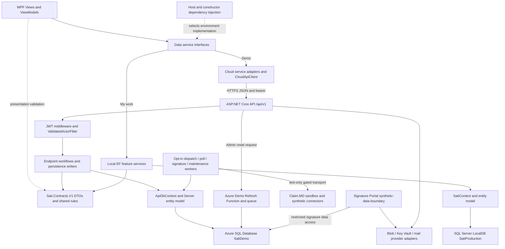

# Sati Architecture and Engineering Assessment

**Assessment date:** October 8, 2026, America/New_York.  
**Reviewed commit:** `a1af92129f60728a0bbcf0dd27c42190644b1e3b`, branch `master`.  
**Source release:** 1.3.37 (`Sati.csproj:14–16`). The worktree was clean when review began.

## Executive summary

Sati has developed well beyond a simple CRUD application. It contains a substantial WPF case-management client, an ASP.NET Core API, shared business rules and DTOs, relational persistence, revision checks, immutable clinical/financial evidence, scoped authorization, synthetic billing exchanges, and extensive automated tests. Its internal design shows deliberate attention to record integrity and uncertain external outcomes. This does not establish an operationally dependable healthcare SaaS service or regulatory compliance.

There are **two actual systems of operation**. Demo uses WPF → HTTPS API → Azure SQL Database. The owner's “My work” environment uses WPF → local EF services → SQL Server LocalDB, containing real working records. The latter deliberately remains a direct-database application. Future cloud Production is not deployed. The API uses its own `ApiDbContext` and server entity model; `Sati.Persistence` owns `SatiContext`, shared persistence helpers and the migration chain. Consolidating persistence into an assembly has not eliminated the two EF model definitions. Evidence: `App.xaml.cs:555–693`; `Data/DataEnvironment.cs:35–79`; `Sati.Api/Data/ApiDbContext.cs:10–113`; `ARCHITECTURE.md:1810–1880`.

The strongest findings are implemented controls, not enterprise assurances: current account/agency/permission revalidation on protected requests; explicit caseload predicates; expected revisions plus EF concurrency tokens; atomic related database writes; one internal claim line per note; immutable generated files; response deduplication; durable dispatch intent and quarantine of uncertain uploads. The weakest evidence concerns actual service operation: restore/cutover and later-record reconciliation, named alert ownership, deployed least privilege and audit protection, mixed-version behavior, independent security review, and certified real billing.

Two material billing gaps were confirmed by independent source inspection. A fresh API generation key can create another original 837 file after an earlier generation was accepted; current suppression is stronger in the UI than in the API. Also, dispatch rechecks account/profile and financial amendments, but does not repeat the complete documentation/compliance gate after generation. A later attestation revocation can leave queued bytes eligible for upload. These are code-inspected missing protections; this review did not execute those sequences or demonstrate duplicate payment or an actual improper vendor submission. Current server transport is expressly restricted to opted-in Demo/Testing and test accounts, which limits immediate real-money exposure. See Parts 3–4.

Live read-only Azure metadata establishes that Demo currently uses Basic SQL, seven-day short-term backups with local redundancy, no LTR, no zone redundancy, and no returned replication links/failover groups. The API runs on Free F1 with Always On and WebSockets disabled. The planned watchdog alert rules are absent. The temporary `datt-workstation-20261007` firewall rule was present during the initial review; after Josh reported removing it, a follow-up read-only check on October 8 confirmed its absence. This hygiene item is closed. These facts supersede older serverless/deployment descriptions. The assessment made no infrastructure changes.

The defensible commercial position is: **a substantial synthetic demonstration platform, with a partially realized cloud foundation and billing lifecycle; controlled real-data pilots and PHI SaaS operation require additional engineering and independent operational/security/regulatory evidence.** Test results appear in Part 9 and must not be translated into “HIPAA compliant,” “exactly once billing,” or “enterprise ready.”

## Scope, method and evidence classifications

This is an implementation review, not a penetration test, legal opinion, actuarial/billing certification, or exhaustive formal proof. Source, test bodies, project definitions, release scripts and relevant architecture/decision/agenda/operations/regulatory guidance were inspected. Three parallel reviews covered security, billing/failure recovery and operations; consequential billing findings received an independent cross-check. Relevant automated tests were run in synthetic/disposable fixtures. Azure reads were restricted to control-plane metadata. No real client database, PHI, private appsettings, credentials, issued tokens, vendor account, unrestricted live log or crash dump was inspected. No production code, application configuration, working database, migration target or infrastructure was changed. Markdown reports and normal build/test outputs were created.

References use repository-relative paths and one-based line numbers at the reviewed commit. Ranges identify the relevant implementation block, not a claim that every line was executed. Historical release records are identified as historical; they are not substituted for current test execution or live acceptance. Detailed evidence inventories accompany this report in `assessment-working/security.md`, `billing.md`, `operations.md`, and `live-demo-evidence.md`.

| Classification | Meaning in this report |
|---|---|
| Verified by implementation and testing | Inspected code and executed tests establish the stated, bounded behavior. This never implies every input, deployment or failure mode is proven. |
| Implemented but incompletely tested | Mechanism is present; important provider, negative-path, concurrency, environment or operational assurance remains missing. |
| Partially implemented | Some requested stages exist; material lifecycle stages or operating controls remain absent or gated. |
| Not established | Available evidence does not establish the requested guarantee. This may coexist with useful preparation scripts. |

| Requested area | Overall classification |
|---|---|
| 1. System architecture | Implemented but incompletely tested |
| 2. Authentication, authorization and tenancy | Implemented but incompletely tested |
| 3. Notes and complete billing lifecycle | Partially implemented |
| 4. Idempotency and failure recovery | Implemented but incompletely tested; external exactly-once outcome not established |
| 5. Transactions, concurrency and notifications | Implemented but incompletely tested |
| 6. Deployment, updates and rollback | Partially implemented |
| 7. End-to-end backups/disaster recovery | Not established |
| 8. Audit and operational observability | Partially implemented |
| 9. Security assurance and testing | Implemented but incompletely tested; bounded executed fixture behaviors verified |
| 10. Commercial/technical readiness | Partially implemented |

## 1. System architecture

**Classification: Implemented but incompletely tested.**

### Implemented component diagram

The diagram includes implemented adapters that may be disabled/unprovisioned. It does not imply that signature mail, portal hosting, Claim.MD, chat notices or maintenance workers are currently active in Azure. `Sati.Portal`, `Sati.Signatures`, and the limited Avalonia `Carika` client exist; none makes Sati a complete web/mobile product. `karuna` and `upekkha` solution folders reserve future ownership, not deployed applications (`SatiLogica.slnx`; `Carika/Carika.csproj:1–29`).

### Component ownership and interaction

| Component | Purpose and actual owner | Interaction/boundary |
|---|---|---|
| WPF client | `Sati.csproj:3–16`; `Views/`, `ViewModels/`; CommunityToolkit.Mvvm | Binding and commands present/edit records; service interfaces carry requests. Client preflight helps users but cannot authorize cloud writes. |
| Composition root | `App.xaml.cs:101–165,555–693` | Microsoft.Extensions.Hosting registers lifetimes and chooses all-local or all-cloud persistence. Constructor injection supplies dependencies. Shared services include session/presentation coordination. |
| Feature service seam | `Data/INoteService.cs:8–29`, other `I*Service` contracts | Allows one ViewModel to call local or HTTP implementations. These interfaces are client abstractions; API endpoints do not generally call the desktop implementations. |
| Cloud transport | `Data/Cloud/CloudCoreServices.cs:92–181`; `CloudApiClient.cs:21–44,401–445,526–597` | Converts local presentation models to DTOs, sends JSON/bearer over HTTPS, maps typed failures and guards token generation. No Demo EF fallback is registered. |
| API host/security | `Sati.Api/Program.cs:154–176,218–284`; `Endpoints/ApiEndpoints.cs:42–94` | JWT middleware then database-backed actor validation, write execution scope, endpoints and domain filters. Most application workflow remains in endpoints, including a large monolithic partial class. |
| Shared contracts/rules | `Sati.Contracts/V1`; `Sati.Contracts.csproj:1–16` | EF/WPF-free DTOs and authoritative portable rules such as NoteWorkflow, ServiceTimeline, billing/compliance, amendments, assessment review and CSV. Both operating paths call these owners. |
| API persistence | `Sati.Api/Data/ApiDbContext.cs:10–113,819–891` | Request-scoped context from a factory, Server entities and selected shared configurations/writers; SQL Server provider. It is distinct from SatiContext. |
| Local persistence/migrations | `Sati.Persistence/Data/SatiContext.cs:100–160`; `Sati.Persistence/Migrations/`; `Data/NoteService.cs:9–65` | Portable EF entity model/migration chain; desktop local services create a short-lived context per operation. Existing local service code is still in the WPF project. |
| Cloud external work | `ClearinghouseDispatchWorker.cs`; `ClaimMdSandboxPoller.cs`; `Sati.Signatures/SignatureMailWorker.cs` | Database-backed intent/checkpoints and optional background adapters. External I/O cannot be part of an atomic SQL transaction. Activation restrictions matter. |
| Demo refresh | `Sati.DemoRefresh`; `DemoMutationLeaseMiddleware`; reset SQL/scripts | Separate Function/queue/reset identity. Database application locks exclude mutations during reset; identity rotation invalidates old sessions. This is synthetic reset, not PHI disaster recovery. |

EF Core already supplies query/change tracking and unit-of-work behavior through DbContext/DbSet. Sati does not have a universal additional generic repository layer. Feature services and dedicated workflow stores are the practical abstractions. There is no architectural benefit in saying “we use repositories” merely because persistence lives behind an interface. A context is an operation's tracked database work, not a permanent connection or shared ViewModel database object.

### Complete progress-note save path

1. The user works in the WPF note editor bound to `ViewModels/Children/NoteEntryViewModel.cs`. Local preflight covers schedule overlap, activity/form links, dates, required content and compliance. `SaveAsync` at `:2540–2640` builds or changes a Note and calls injected `INoteService.AddNoteAsync` or `UpdateNoteAsync`. This may save a draft or request Logged submission; Save does not inherently mean clinical approval.
2. Demo resolves `CloudNoteService`. `AddNoteAsync` POSTs `SaveNoteRequest` to `/api/v1/notes`; update PUTs `/notes/{id}` with expected revision. It converts the safe response back into the client model and maps stale/time/submission failures (`CloudCoreServices.cs:92–163`). `SaveNoteRequest` contains content and selected identifiers, not password material or an authoritative agency (`Sati.Contracts/V1/Contracts.cs:335–359`).
3. `CloudApiClient` attaches the current in-memory bearer. ASP.NET validates it, then `ValidatedActorFilter` confirms user, enabled/security version, agency, role, permissions and database-instance identity against stored facts (`TenantAccess.cs:107–155`). The shared route group requires authorization and adds `SingleAttemptWriteFilter` (`ApiEndpoints.cs:45–50`).
4. `MapNotes` normalizes scheduling against the server decision date, validates fields, and begins `ServiceTimeWriteScope`. It checks current own-caseload ownership and exact form links, annual progress, submission permission/compliance, and overlapping reserved time. New notes receive AgencyId from the actor (`ApiEndpoints.cs:4833–4904`). Updates load scoped existing rows and compare expected revision, editable status and permitted transition (`:4934–5008`).
5. The serializable scope acquires a SQL transaction-owned application lock per agency/case manager. Related note saves, exact linked form opening/completion/attestation and appropriate evidence share that transaction. Some `SaveChanges` calls occur before final validation to make linked completion available to the gate, but final refusal disposes an uncommitted transaction: the intermediate rows are not intentionally left behind (`:4905–4931,5050–5087`; `ServiceTimeWriteScope.cs:14–64`).
6. On commit, the API returns a NoteDto. An update refreshes the client revision. The editor clears the saved draft and awaits related profile/caseload/calendar refresh; a refresh failure is explicitly reported as “saved, but related views could not be refreshed” (`NoteEntryViewModel.cs:2627–2639`). Display-refresh failure is separate from persistence failure.
7. In “My work,” the interface resolves `Data/NoteService.cs:9–65,99–177`. It validates the current local session and ownership, sets tenant identity, calls the same schedule and portable workflow rules, writes through a fresh SatiContext, and commits. This path uses neither JWT nor the API.

A general note-create request has no durable client operation GUID (`Contracts.cs:335–359`). Agenda-generated exact-form drafts have a special reuse path (`ApiEndpoints.cs:4860–4873`), but that is not generic note-save idempotency. If a create commits and its HTTP result is lost, the desktop needs to inspect persisted notes before recreating. Time-overlap checks can catch some repeats, but cannot be described as a general identity-based replay guarantee for all drafts/unbilled work.

**Evidence limits:** existing HTTP note/form/workflow tests exercise meaningful atomicity and refusal paths; provider-specific concurrency is examined separately in Part 9. No real user's note was traced. Two EF models and continued local/client coupling remain maintenance risks, not proof of a broken save path.

## 2. Authentication, authorization and tenant isolation

**Classification: Implemented but incompletely tested.**

API passwords are stored as salted PBKDF2-HMAC-SHA256 verifiers: 100,000 iterations, 16 random salt bytes, 32 output bytes and constant-time comparison. An unknown username runs decoy hashing; login returns the same unauthorized response as wrong password (`PasswordVerifier.cs:8–68`; `ApiEndpoints.cs:1320–1343`). The format has no evidenced hash-version/upgrade-on-login mechanism. Ordinary passwords require 8–128 characters; first administrator bootstrap has its own stronger minimum (`ApiEndpoints.cs:11009`; `AdministratorBootstrap.cs:44–46`). No MFA, federated identity, breached-password check or persistent distributed lockout was found. Per-name and whole-instance rate limits are in-memory (`LoginAttemptGuard.cs:5–42`; `Program.cs:200–205`).

`TokenIssuer.cs:25–52` issues HS256 JWTs carrying user, agency, role, jti, original authentication time, database-instance ID and SecurityVersion. Source defaults are 30-minute bearer lifetime and 720-minute renewal cap (`Infrastructure/ApiOptions.cs:5–12`); deployed secret values/options were deliberately not inspected. Middleware validates issuer, audience, signature and lifetime, allowing 30 seconds of clock tolerance (`Program.cs:160–176`). `/auth/renew` requires a still-valid bearer, retains initial authentication time and refuses renewal after the cap (`ApiEndpoints.cs:1365–1399`). There is no separate long-lived refresh token. The cap limits renewal; a token renewed near that boundary can remain usable until its own expiry for ordinary HTTP calls. Chat independently enforces the earlier session/token expiry.

Protected requests reload the current account. A token's old permissions are not trusted: the filter removes incoming permission claims and adds database-derived capabilities. Password change/reset, disable/re-enable and Admin session revocation increment SecurityVersion, invalidating prior bearers on subsequent calls. Reset instance rotation also invalidates sessions. There is no observed per-device session registry or individual-jti revocation list. Revocation does not retrieve already delivered data or guarantee cancellation of all in-flight authorized work (`TenantAccess.cs:107–155`; `AccountLifecycleEndpoints.cs:15–60`; `ApiEndpoints.cs:1492–1547`; `AccountSessionRules.cs:14–37`).

Roles and permissions are stored separately. CaseManagement, Supervision, Administration, Billing, AgencyWideSupervision and RepresentativePayee are explicit flags (`UserPermissions.cs:8–77`). Agency Admin is not automatically every operational capability. Scoped supervision requires both capability and assignment unless broader reach is explicitly granted. PlatformOperator is a separate, narrowly permitted cross-tenant operational-support identity, not blanket clinical access. User-management rules prevent a scoped supervisor from assigning/taking over privileged accounts (`UserManagementRules.cs:37–100`).

The agency comes from a validated persisted account. Caller user/person IDs select a requested target and are checked before query/write. `CanAccessUserAsync`, `CanAccessPersonAsync`, `OwnedPeople` and own-caseload checks compare owner and person agencies and current capabilities (`TenantAccess.cs:10–90`). Examples include journals, contacts, caseload, notes, user changes, history/export and narrow billing DTOs. Local services revalidate their own stored session/capabilities rather than assuming the API is the only caller (`LocalTenantAccess.cs:23–108`). A billing-only account does not thereby receive clinical narrative (`BillingPrivacyTests.cs:14–27`).

**The general database tenant wall is not independently established.** No blanket EF query filter or SQL row-level-security policy is implemented in the reviewed Sati contexts/migrations. Some newer aggregates use composite tenant foreign keys; core Person/User/Agency relationships remain separate single-column keys (`SatiContext.cs:453–464`). Isolation is largely explicit application predicates plus current actor validation and tests. This is real enforcement, but one omitted future predicate or privileged direct SQL path is consequential. An inconsistent owner/agency combination is representable, though tests deliberately deny/omit such records. No current exploitable cross-tenant route was demonstrated.

Substantive tests include `TenantAuthorizationTests`, `UserSessionApiTests`, `ConsumerPermissionRevocationTests`, `SupervisionGateTests`, `CaseloadTransferApiTests`, `DemoResetApiTests` and local counterparts. They test anonymous/foreign-agency denial, revoked capabilities, account versions, privileged takeover, exact ownership and missing success effects. Most use SQLite/TestServer; they do not prove deployed Azure permissions, complete JWT signature/issuer/audience/expiry negative matrices, multi-instance throttling, MFA or key rotation/incident response. Historical open findings 6/7 in `API_SECURITY_AUDIT.md:441–460,549–552` are superseded by current owner predicates and claim stripping; repeating them as present vulnerabilities would be inaccurate. Detailed test references are in the security evidence inventory.

## 3. Progress notes and the billing lifecycle

**Classification: Partially implemented for the complete external lifecycle.**

| Stage | Implemented behavior and evidence | Qualification |
|---|---|---|
| Draft/scheduled work | Note editor, normalization, persistence and shared `NoteWorkflow` | A plan or draft is not evidence of occurred work. |
| Logged submission | Server validation, exact form/activity links, date/compliance rules, service-time reservation | Submitted narrative is locked against ordinary author edits; returned notes follow the defined workflow. |
| Supervisor review | Scoped independent capability checks, expected revision, time checks, approver/time and audit (`ApiEndpoints.cs:1780–1969`) | Approval is clinical workflow status, not a claim or payment. Specific form compliance exceptions require explicit evidence and retain their scope. |
| Billing candidates | Approved eligible notes projected from current source; amendment holds and existing lines excluded (`:10417–10461,6801–6851`) | Queue is a query. Some candidates are shown with validation errors; approval alone does not imply financial eligibility. |
| Claim promotion | Billing permission, period lock, fresh source/compliance/readiness, one note→line, frozen financial/payer evidence (`:6854–7025`) | Reviewed manual authorization evidence is not a server-owned authorization/utilization balance. |
| Period submission | Draft→submitted with fresh validation and audit (`:7046–7118`) | Internal locking step, not clearinghouse transmission. Return-to-draft refuses exchange history. |
| 837P generation | Submitted period, GUID key, fresh export checks, exact retained immutable bytes (`:7185–7298`; `ApiEndpoints.BillingExport.cs:14–114`) | Generating/downloading a file does not send it. Supported synthetic formatter output is not vendor certification. |
| Dispatch | Retained test file/account → durable dispatch → opted-in server worker (`ClearinghouseDispatchEndpoints.cs:67–157`) | Actual connector gate is Demo/Testing-only and test-mode; future real Production transport is not available through this gate. |
| Acknowledgments | Bounded 999/277CA X12 intake and separate Claim.MD XML status adapters | 999 syntax acceptance, claim acknowledgment, clearinghouse receipt and payer payment remain distinct facts. |
| Remittance | Bounded 835 parser/import, retained encrypted original, matched outcomes/adjustments/payment evidence | This is not general certification for every payer layout or every adjustment sequence. |
| Bank reconciliation/correction | Append-only bank deposit evidence and explicit rejection resend/replacement/void lineage | Paid remittance does not establish money in the bank; local working path lacks the cloud response/correction adapters. |

The shared 837 formatter supports 5010 envelopes, subscriber/provider/payer facts, charges/service dates and claim/line identity. Configured v2 claims add rendering/service-facility output, prior-authorization REF G1, stable Claim.MD REF D9 and correction REF F8 (`Professional837Formatter.cs:25–121`; `ServerEdiGenerator.cs:9–44`). Older documentation that says facility output is absent is stale. Current documented payer scope is a bounded Section 13 single-line unit basis; broad multi-line authorization/utilization is unfinished. `PayerBillingRules.ValidatePreparation` validates reviewed references, person/profile/procedure/rendering scope, dates and modifiers (`PayerBilling.cs:155–184`); it cannot independently establish an actual remaining payer authorization balance. `AGENDA.md:9153–9163` explicitly defers that ledger.

999 matches retained envelope/group/transaction facts; 277CA/835 match retained claim/line identities, amounts, direction, environment and payee. Ambiguous/unmatched content is refused. Import retains encrypted original bytes plus provenance and atomically writes receipt/matches/outcomes/events/deposit (`ClaimResponseIngestion.cs:232–371`). It avoids treating a late acknowledgment as a regression of later status. Claim.MD status A is receipt and R is rejection, never proof of adjudication (`ClaimMdStatusProcessor.cs:11–136`). Status and ERA feeds have independent durable cursors (`ClaimMdSandboxPoller.cs:54–115`).

835 explanation is incomplete: the parser accepts LQ without projecting RARC and retains only the first CAS group/reason in the worklist, although protected raw evidence preserves the original (`ClaimResponseReader.cs:302,361–402`). Unsupported financial layouts fail closed. Frequency 1 resend, 7 replacement and 8 void have explicit retained correction provenance and standing response rules (`ClaimCorrectionRules.cs:83–144`; `BillingCorrectionEndpoints.cs:138–220`). Actual payer/vendor acceptance of these exact transactions remains unverified.

Interrupted database stages either roll back or return/replay retained state where operation identity exists. External uncertainty is quarantined; rejected claims need reviewed corrective action; additional payments/reversals or conflicting response identities can require review. An unmatched feed item does not advance its cursor, preserving evidence but potentially blocking that account until operator resolution. No complete feed quarantine/skip/reconciliation workflow was found.

Local `BillingService`/`EdiService` generate Office Ally files and write them under the workstation EDI directory after retaining generation/audit; exact-byte regeneration handles failed disk output (`Data/Billing/IdeService.cs:29–118,198–203`). The local contract reports response intake, dispatch and claimed-note correction unavailable (`IBillingService.cs:19–36,105–125`). Cloud implementations exist despite their historical filename `CloudUnavailableServices.cs:605–825`.

## 4. Idempotency and failure recovery

**Classification: Implemented but incompletely tested internally. External duplicate-safe submission is not established.**

Idempotency is tied to **the same identified operation**, not to any apparently similar command. Sati protects distinct boundaries with different identities:

| Boundary | Protection | What it does not establish |
|---|---|---|
| Original claim line | Unique NoteId plus scoped transaction/precheck (`ApiDbContext.cs:492–515`) | One line can still be exported in multiple files. |
| Period submission | Status replay/concurrency plus period application lock | It does not send a file. |
| File generation | Normalized GUID scoped to agency/actor, unique key/control number, immutable bytes; mismatched reuse refused | Another GUID or actor identifies another operation. |
| Exact file dispatch | Unique EdiGenerationId and retained dispatch; repeat returns existing intent | It is not a lifetime uniqueness rule for the business claim. |
| Uncertain period | Another queue request blocked while Queued/Sending/OutcomeUnknown exists | Accepted prior generation is omitted from this period-level block. |
| Response processing | Raw/semantic/payment/artifact identities and relational unique indexes; atomic receipt/effects | Unsupported or conflicting later transactions can need manual review. |
| Feed polling | Account/feed/artifact identities and transactional cursor/effects | Vendor listing completeness, remote retention and operator unblock remain external/operational matters. |

Schema evidence is in `ApiDbContext.cs:492–515` and `ClearinghousePersistenceModel.cs:32–105,155–194`. These constraints work under concurrency in the relevant database scope; application write guards are not protection from a privileged SQL administrator.

### Lost confirmation and process restart

The worker preflights account, test mode, encryption/key availability and amendment version while Queued. It commits Sending **before** network upload (`ClearinghouseDispatchWorker.cs:73–125`). A connector exception or ambiguous/malformed response yields OutcomeUnknown (`:127–145`). It does not interpret timeout as “the clearinghouse definitely did not receive it.” If the process dies or final receipt commit fails, Sending can remain durable with no completed attempt (`:155–190`). Restart selects Queued only; it never automatically retransmits Sending/OutcomeUnknown (`:55–71,194–223`). This trades automatic availability for safer duplicate avoidance.

An Admin reconciliation command obtains exclusive dispatch/period coordination, checks exact revision/account/generation/filename/hash/claim identities and retains structured dated evidence. ConfirmedReceived records receipt; ConfirmedNotReceived requires support evidence, becomes a separate terminal state and does not resend. Original attempts remain immutable. Audit explicitly admits vendor byte identity is not independently verified (`ClaimMdReconciliationEndpoints.cs:19–163`). Recovery of a Sending record can therefore require a person contacting/checking the vendor; database restart alone does not resolve it.

Claim.MD receives a stable D9 identity based on namespace/agency/period/note while CLM01 changes with generation control number (`ClaimSubmissionIdentity.cs:16–34`). Onboarding records an Admin's claim that the dedicated test account uses remote_claimid-only duplicate settings. It does not remotely validate them. Vendor duplicate rejection, delayed acceptance, status completeness, nonreceipt proof and correction semantics require retained account-specific sandbox certification. No vendor was contacted in this review.

### Material inspected gaps

**R1 — Fresh originals after acceptance.** Original generation with a fresh key produces another complete frequency-1 file (`ApiEndpoints.cs:7198–7260`; `ServerEdiGenerator.cs:39–40`). Queue checks previous transmission of the same generation, then only Queued/Sending/OutcomeUnknown for the period (`ClearinghouseDispatchEndpoints.cs:104–129`). Worker/status/remittance does not change submitted period status to make further original generation impossible. WPF excludes progressed/generated periods (`BillingSubmissionsViewModel.cs:816–823`), but direct authorized API callers do not inherit that restriction. Source inspection by two reviewers confirms the absent server gate; no duplicate-payment exploit was executed. Same-file tests and unresolved-state tests omit fresh-key-after-Accepted (`ClearinghouseDispatchApiTests.cs:54–82,104–134`). Before real transport, require an explicit server original/correction lifecycle rule and prove it with a failing-then-fixed regression.

**R2 — Eligibility can change after generation.** Export checks complete compliance, but queue/worker call only the amendment dispatch guard alongside account/profile gates (`ClearinghouseDispatchWorker.cs:73–115`; `NoteAmendmentDispatchGuard.cs:9–20`). Form attestation revocation appends evidence and linked billing-review flags without cancelling queued dispatch (`ApiEndpoints.cs:8554–8615`; `ApiEndpoints.FormNoteAttestation.cs:403–443`). No general revalidation/cancellation on external release was found. This intervening-change sequence was not executed; it is a confirmed missing gate, not an observed vendor release. Decide which changes must hold immutable queued files, enforce that centrally, and test revocation between generate/queue/upload.

**R3 — General note-create ambiguity.** Notes lack a generic operation key, unlike generation and receipts (Part 1). A lost response can leave a user uncertain whether creation committed. Financial line uniqueness alone does not stop two distinct recreated Note IDs representing the same work. Clinical overlap rules help but are not a complete business duplicate detector.

Existing joined pipeline tests explicitly lose successful generation/835 HTTP responses, recreate hosts over retained fixture data and replay the same key/document without extra effects (`JoinedBillingPipelineAcceptanceTests.cs:86–144`). This is executable internal evidence, not a physical process-kill, real vendor upload-timeout or restore-after-external-send proof. Worker timeout and manual reconciliation tests provide additional bounded evidence. No global “exactly once” claim is warranted.

## 5. Transactions, concurrency and notifications

**Classification: Implemented but incompletely tested.**

A database transaction combines database effects, not SQL and an external clearinghouse into one indivisible operation. Important atomic groups include note plus exact form evidence; approval plus its audit; Person change plus immutable PersonVersion; claim line plus frozen inputs/audit; period status plus audit; generation plus retained bytes/event/audit; response receipt plus matches/outcomes/deposit/checkpoint; signature request plus encrypted outbox; governance/assessment versioned decisions plus evidence. Owners are `MapNotes`, supervisor routes, `Sati.Api/Infrastructure/PersonLifecycle.cs:107–170`, billing endpoints/intake, `SignatureWorkflow`, and shared persistence writers.

`ServiceTimeWriteScope.cs:14–64` obtains serializable isolation and a transaction-owned exclusive SQL application lock per agency/case manager, across dates. `BillingPeriodWriteScope.cs:15–66` similarly serializes period work. This coordinates multiple hosts, unlike a C# lock in one process. Exact expected revisions are also checked and configured as EF concurrency tokens (`ApiDbContext.cs:126,134,331,492`; `SatiContext.cs:543`). They are explicit version counters/status tokens, not generally SQL rowversion columns. Stale writes return typed 409 conflicts; clients keep/reconcile attempted work. SQL application locks are targeted pessimistic coordination, used with optimistic record versions.

Competing authorized approval/return actions cannot both overwrite the same observed revision silently: the first commit changes revision; the second conflicts/reloads or finds an invalid transition. Approval also reloads current reviewer/source inside the schedule lock (`ApiEndpoints.cs:1780–1835`); return checks claimed-note restrictions (`:1927–1969`). Wider race combinations, such as return versus financial promotion or permissions changing after authorization, need specific lifecycle tests; revision is not a magical global transaction across independent records.

`SingleAttemptWriteFilter` surrounds API writes with a zero-retry execution strategy (`Infrastructure/SingleAttemptWriteFilter.cs:14–42`). SQL reads retain configured transient retries. This avoids silently replaying an ambiguous write commit even though SQL Server retry behavior is enabled at registration (`Program.cs:154–155`). The request then needs a retained operation identity/state check for safe recovery. It is therefore incorrect to say all failed API writes automatically retry safely.

There is no general persisted notification table/outbox for every note/approval/billing candidate. Supervisor and billing worklists read durable record state. A note can save even if a subsequent UI refresh fails, and a later reload can recover the view. Supervisor approval is a later separate transaction; a failure there leaves the original submitted note waiting for review.

Notifications have distinct mechanisms:

| Mechanism | Persistence/delivery | Transaction/recovery boundary |
|---|---|---|
| Worklists | Queries of persisted notes/claim/evidence state | No separate approval→queue message to lose. UI reload is necessary. |
| Chat notices | Process-local bounded contentless channels/WebSocket signals (`ChatInfrastructure.cs:55–97`) | Messages/changes and access evidence are in SQL; notice can be dropped/coalesced and polling refetches them. No multi-instance notification bus is established. Live WebSockets are disabled. |
| Signature mail | Encrypted SQL SignatureOutbox staged with workflow, persisted lease/operation GUID, bounded retry/poll (`SignatureWorkflow.cs:144–151`; `SignatureMailWorker.cs:24–120,166–240`) | Durable outbox exists. Provider acceptance/completion is not inbox delivery. Synthetic environment/recipient/activation restrictions remain. |
| Clearinghouse dispatch | SQL intent, immutable attempts/receipts and worker (Part 4) | Durable external-work outbox; uncertainty quarantines rather than blind retry. |
| Demo reset | Function queue and poison outcome plus SQL/reset lock | Durable job path; missing/failed outcomes require external monitoring. |
| Desktop incidents | Account/credential-bound local outbox and retry | Operational telemetry, not clinical reportable incidents; not one transaction with clinical persistence. |

Append-only guards reject tracked modification/deletion of audit, generated EDI, retained attempts/receipts and selected record versions (`ApiDbContext.cs:819–891`; `SatiContext.cs:105–160`). They are useful integrity controls. Database denies, hold-compatible backup policies, external immutable evidence and privileged recovery remain separate assurances.

## 6. Deployment, updates and rollback

**Classification: Partially implemented.**

Desktop delivery uses separate self-contained Windows x64 Demo and Local installers. Demo packaging refuses private appsettings/non-HTTPS mapping; Local intentionally bundles a verified Microsoft-signed LocalDB prerequisite and integrated-security mapping (`Build-DemoInstaller.ps1:30–43,101–176`; `Build-LocalInstaller.ps1:27–59,83–137`; `scripts/Publish-Demo.ps1:35–53`). Installation is per-user with separate shortcuts/uninstall entries. The latest release record reports 1.3.37 publication and isolated acceptance on LONGCHENPA; external clean-machine attestation remains unverified (`AGENDA.md:52–63`). This review built test dependencies but did not install or publish packages.

Updates are manual external installer operations. No automatic update feed, download scheduler or mandatory client-update enforcement was found. The Local bootstrap can extract/launch installation independently of the main application, so a nonlaunching app does not prevent rerunning a reviewed installer (`installer/Sati.LocalBootstrap/Program.cs:17–69`). Installers refuse running Sati processes, but overwrite files directly in the existing installation directory (`Install-SatiDemo.ps1:98,107–119`; `Install-SatiLocal.ps1:142,151–163`). There is no evidenced atomic directory swap, old-binary snapshot or automatic post-install rollback. Interruption may leave mixed/incomplete files; that possibility was not injected. A prior installer can repair binaries manually, but compatibility with an already upgraded database must be verified separately.

Sati's installer is not publisher-code-signed; the signed Microsoft MSI does not authenticate the Sati wrapper (`installer/README.md:86`). Distribution hashes are useful only when the expected hash arrives through a trusted channel. Installer signing and crash-safe replacement are sensible engineering improvements, distinct from the more consequential restore and authorization gates.

The API reports release plus a fingerprint of routes and manually declared contract-shape revisions (`Program.cs:269–284`; `ApiSurface.cs:18–23,36–82,421–440`). Desktop compatibility fetches and compares it, **then warns without blocking sign-in or writes** (`CloudApiCompatibilityService.cs:16–53`; `IApiCompatibilityService.cs:31–34`; `ShellViewModel.cs:587–622`). Failed comparison returns agreement/clears the warning. Equal release numbers can have different fingerprints; unequal fingerprints do not identify upgrade direction or prove every DTO/rule difference was recognized. `ApiCompatibilityTests.cs:23–117` verifies warnings using fake HTTP, not real old/new server combinations. Statements elsewhere that a named capability “blocks” older API interpretation exceed this global gate's actual behavior. Silent field loss against a concrete older version remains an unexecuted mixed-version hypothesis, not a demonstrated current data loss.

API-only deployment is possible for compatible contracts. No general supported-version matrix, minimum client admission check, automated backward-compatibility suite, tenant canary or staged-rollout mechanism was found. Feature switches exist for specific gated workers/chat/signatures/transport; these are not general deployment canaries (`ApiOptions.cs:44–49`). Release tooling manually publishes a reviewed ZIP, checks live/ready/version/fingerprint and retains a prior healthy package. Rollback is separately authorized/manual (`RELEASE_PLAYBOOK.md:238–258,286–296`), not automatic.

Cloud startup does not run migrations. Controlled scripts require known database identity, expected predecessor/schema semantics and rehearsal/apply/idempotency checks; narrow migration-history reconciliation is not a complete Sati.Migrator service (`AGENDA.md:6259–6330`). Readiness's schema probe detects query-blocking differences; it does not repair them (`SchemaDriftHealthCheck.cs:45–85`). Restoring previous API bytes after a destructive/incompatible migration is not proven safe.

Local schema activation differs: `LocalDatabaseUpdater` runs before sign-in, detects partial effects, requires pre-migration backup when People exist, performs pinned repairs/history reconciliation and stops launch on failure/NeedsRepair (`App.xaml.cs:316–350`; `LocalDatabaseUpdate.cs:194–331`). `SqlLocalDatabaseMaintenance.cs:73–98` makes a same-workstation SQL backup before migration. It does not restore on failure or verify a restore. Second-resolution filename plus WITH INIT also permits an untested same-second overwrite collision. No working Local schema or backup was accessed in this assessment.

## 7. Backups and disaster recovery

**Classification: Not established for complete service recovery.** Backup configuration is observed; a partial rehearsal adapter exists.

### Actual Demo configuration observed

Bounded read-only Azure metadata on October 8 returned:

| Setting | Observed value |
|---|---|
| Service/database | Azure SQL Database, `SatiDemo`, logical server `sati-demo-satilogica-central` |
| Compute | Basic, capacity 5; Online |
| Current/requested backup redundancy | Local / Local |
| Short-term retention / differential interval | 7 days / 12 hours |
| Long-term weekly/monthly/yearly retention | All `PT0S` |
| Zone redundancy / read scale | false / Disabled |
| Earliest restore metadata | `2026-10-01T14:51:13.622339+00:00` |
| Replication links / named-server failover groups | Both empty lists |

Exact commands/projections/results are recorded in `assessment-working/live-demo-evidence.md`. Historical `DATABASE_ENVIRONMENTS.md:142–167` serverless inventory is stale for current compute. These checks did not inspect data or initiate restoration. An earliest restore date is not proof of successful recovery. No zone/geo replica or LTR configuration can be inferred from Microsoft's available product features.

Microsoft documents that PITR creates a separate database and that later record recovery requires a deliberate data-recovery procedure. Geo-restore requires geo-redundant/GZRS backup storage; current Local redundancy does not establish that option. Microsoft manages the underlying backup mechanism; Sati must own the recovery choice, credentials/identity/key availability, applications, record correctness, monitoring and operator procedure. See [Microsoft: restore from backups](https://learn.microsoft.com/en-us/azure/azure-sql/database/recovery-using-backups?view=azuresql) and [automated backups](https://learn.microsoft.com/en-us/azure/azure-sql/database/automated-backups-overview?view=azuresql). Neither documentation nor configured retention is a measured Sati RPO/RTO.

`Invoke-DemoRestoreVerification.ps1:39–119,247–355` prepares a gated PITR into a uniquely named owned scratch database, checks historical instance identity/migration inventory/selected counts, records evidence and cleans only its owned target. Its fake-operation tests check orchestration/safety, not cloud backup contents. `OPERATIONS.md:231–320` says actual Azure rehearsal requires separate approval and has not established full restoration. No restore was performed for this review.

That adapter does not repoint/restart a recovered service, run clinical/billing workflows, recover Key Vault versions/blob evidence, prove content integrity, reconcile external claims or merge valid later writes. It is a prepared verification tool, not complete disaster recovery. Numeric accepted and measured RPO/RTO were not found. Recoverability of the current owner's PHI store is likewise unverified: pre-migration same-disk backups do not establish a periodic, independent encrypted recovery process.

### Failure cases and what remains necessary

| Failure | Available mechanism | Missing demonstrated procedure |
|---|---|---|
| Accidental delete or corrupt application writes | Candidate PITR within actual retention; immutable/versioned records can aid comparison | Authorized restore, verification, selective reconciliation and service recovery. |
| Local migration/defective update | Pre-migration backup and retained installer/package | Tested independent restore and compatible binary/schema rollback. |
| Infrastructure outage | Managed service recovery within selected configuration | Sati regional failover/cutover, usable service objective and external monitors; none proved by current replica metadata. |
| Wrapping-key/blob loss or mismatch | Version-bound encrypted evidence and provider abstractions | Joint recovery of SQL, protected originals/blobs and key versions. Copying SQL does not prove decryptability. |
| Defect predating many legitimate new records | Historical SQL/versions could support comparison | Safe post-point merge/replay retaining identities, tenant scope, immutable lineage and audit. No implemented complete adapter. |
| Restore after a claim was externally sent | Retained dispatch/claim identities can assist if surviving evidence is available | Reconcile vendor state before any resend; restored SQL may no longer remember an external action. |

A restore to yesterday preserves yesterday's timeline and excludes today's writes from the recovered database, including valid notes, audits and receipts. Sati is not a complete event-sourced system capable of rebuilding every later record from its activity log. A reviewed reconciliation must preserve record identifiers/dependencies, append-only provenance and external outcomes. Blind recreation risks duplication and rewritten history. This is the central application-level recovery gap, not a defect Microsoft can solve by keeping backups.

## 8. Logging, audit trails and observability

**Classification: Partially implemented.** Audit and incident mechanisms are real; their scope/integrity/operational coverage is incomplete.

`AuditTrail.cs:5–24` stages actor/agency/action/resource/correlation/metadata into the same scoped API context. Its event participates in the workflow's transaction **when that workflow calls it**. EF does not automatically audit every changed row. Normal successes include authentication, approvals/returns, selected profile/document/settings/user changes, claim promotion, generation/exchange and controlled exports (`AuditTrail.cs:29–139`). PersonVersion is a separate intentional PHI-bearing full-profile/change ledger, not the minimal operational audit (`ApiDbContext.cs:804–817`; `DECISIONS.md:126–138`).

**R4 — General API note audit coverage is missing.** Normal POST note creation writes at `ApiEndpoints.cs:4891–4913` and commits at `:4914–4930` without a general create event. PUT changes content/status/revision at `:5032–5049`; only reassignment and form-specific paths add events before `:5065–5082`. Pending→Logged ordinary submission uses that same unaudited path. DELETE at `:5113–5116` removes/saves with no AuditTrail parameter. No automatic row audit generator was found in group filters, provider registration, SaveChanges overrides or repository SQL trigger definitions. Local NoteService explicitly audits creation/editing (`NoteService.cs:53,164`), demonstrating uneven coverage. This is independently implementation-confirmed; no failing regression was executed, and uninspected out-of-repository live triggers remain unverified. Approval/form histories do not retrospectively prove ordinary draft changes.

Failed logins emit operational warning/IP rather than AuditEvent (`ApiEndpoints.cs:1342–1350`). Generic unauthorized/forbidden/not-found exits have no centralized actor/target/reason deny ledger. Tests showing rejected writes produce no **success** audit do not establish attempted-access evidence. Most clinical reads are not blanket-audited, though explicit SSN decryption, chat release, Person history/export and selected sensitive accesses are.

Admin audit access is agency-scoped, bounded to 1–500 rows; reason/window-gated CSV caps at 10,000 and audits the export. Responses omit MetadataJson (`ApiEndpoints.cs:238–284,1238–1287`). AuditCsv neutralizes formula-leading values. Source policies report audit retention 2,555 days and EDI replay 90, with validated bounds; enforcement remains PolicyOnly (`OPERATIONS.md:16–26,584–598`). New governance implements scoped/versioned holds and independent release but does not activate general runtime purge or complete backup/object retention. Older single-admin-hold documentation is superseded for the new workflow.

Application guards refuse tracked audit/version modifications/deletes (`ApiDbContext.cs:819–891`). They do not stop raw SQL, bulk APIs or a privileged database principal. No cryptographic audit chain or independently immutable external copy was found. Deployed table denies/runtime/migration/support identity separation were not verified. This bounds immutability claims; no audit tampering was demonstrated.

### Tracing, errors and silent failure

Each API response carries its request TraceIdentifier as X-Correlation-ID; audits and structured error responses can share it (`Program.cs:218–239`; `AuditTrail.cs:21`). CloudApiException retains the server correlation (`CloudApiClient.cs:597,626`). There is no established single propagated desktop→API→SQL→worker→vendor transaction trace. Local audit creates fresh per-event desktop correlations (`LocalAuditTrail.cs:7–44`). Retained claim/generation/receipt identities provide cross-stage financial linkage, but are not complete distributed observability.

**R5 — Full API exceptions reach a log sink.** The curated `ApiIncidentRecorder` stores a fingerprint/type/HResult/method, fixed operation and IDs, but global `Program.cs:222` independently passes the entire Exception to ILogger/JSON console; schema probing also logs full exceptions. Messages/inner exceptions may carry sensitive values from upstream code/providers. This is a concrete unsanitized path, not an observed PHI disclosure. Existing selected SSN-path log tests do not inject arbitrary secret/narrative sentinels through every failure sink. Verify sink redaction, access and retention before PHI hosting.

Desktop `AppErrorLog.cs:15–17,134–191` omits exception messages, stores selected shape/stack and rotates at 5 MiB/file, 50 MiB/directory and 30 days. Durable navigation breadcrumbs aid fatal-session diagnosis but do not establish the intermittent crash's cause. Incident telemetry is operational errors, not client reportable-event management. API incident persistence can fail silently and ignores unauthenticated exceptions (`ApiIncidentRecorder.cs:14–16,38–40`); it must not be the sole failure signal.

Live metadata establishes an Application Insights component configured at 90 days and linked workspace, not effective per-table retention, successful ingestion, least-privilege log access or alert receipt. The Demo API has system-managed identity, HTTPS-only and TLS minimum 1.2, but current identity permissions/keys were not read. Its Free F1 plan/Always On false means sleeping hosts constrain in-process workers. WebSockets false constrains prompt chat notice delivery; polling is the fallback.

`DemoWatchdog.ps1:190–250` and `Set-DemoWatchdogAlerts.ps1:31–94,139–148` prepare missing/failed reset, poison and optional backlog checks plus missing-watchdog detection. Current resource reads returned ResourceNotFound for both planned rules, and restricted Demo resource-group inventory found no scheduled-query or metric alerts. A Smart Detection action group alone is not evidence of a named owner receiving these findings. No external monitor or alert delivery test was established. An error before outcome audit, stalled feed, sleeping worker or failed incident write can consequently remain unnoticed.

### The thirty-approved / twenty-five-in-queue scenario

There are no five missing queue messages to hunt: approval updates a Note and audit; the queue is a current SQL projection. The base query requires approved, appropriate billable/effective source, no financial amendment hold, matching note/person/owner agency and no ClaimLine (`ApiEndpoints.cs:10417–10429`). Financial projections can further remove effective Unbilled rows (`:6810–6817`). Compliance/identifier errors on remaining candidates are often returned as errors, rather than silently excluding every noncompliant note (`:6838–6851`). Desktop selected owner/filter/stale load must also be checked.

An authorized engineer would enumerate the thirty approval Note IDs in the bounded time window, distinguish repeat approval events from thirty distinct notes, compare present candidate/claim-line IDs, then inspect each missing note's status/effective amendment/Unbilled/hold/tenant/source facts. Already claimed notes should be absent; claim promotion has an audited Note resource ID (`:7015–7019`). This can identify missing IDs and explain current exclusions, subject to authorized diagnostic access.

There is no built-in approved-versus-candidate reconciliation screen, historic queue membership snapshot or `billing.candidate.excluded` reason ledger. Existing audit interfaces omit metadata. Current facts cannot always prove why a note was absent at an earlier instant, or distinguish then-current data from stale UI/network display. The scenario was not executed and no real records were accessed. Promise “we can investigate current exclusions,” not “our administrative log explains every missing item.”

## 9. Security assurance and testing

**Classification: Implemented but incompletely tested for overall security assurance. Bounded executed fixture behaviors are verified by implementation and testing; critical live guarantees remain qualified.**

Five xUnit projects plus a separate Node portal suite exist:

| Suite | What it exercises | Important substitutes/limits |
|---|---|---|
| Sati.Tests | Shared rules, local services, WPF/ViewModel races, bindings/rendering/structural checks, fake HTTP client adapters, migration models | Mainly SQLite/fakes; structural text tests and a class named “concurrency” are not automatically simultaneous SQL proofs. |
| Sati.Api.Tests | Actual ASP.NET routes, JWT/password/permissions, EF relational writes, tenant refusals, billing integration, failure injection | TestServer replaces real network; ordinary factory uses GUID SQLite, fake wrapping/blob providers and removes startup identity hosted service. |
| Sati.Signatures.Tests | Evidence/workflow/package/outbox/provider adapters and races | SQLite/fake Azure HTTP/key/blob/mail; no actual vendor delivery or legal signature assurance. |
| Sati.Portal.Tests | Portal session/security/origin/document/transport | Eight C# tests; separate Node tests run page code in a harness, not hands-on browser/mobile/screen-reader acceptance. |
| Carika.Tests | Narrow alternate client selection/boundary behavior | Four tests do not establish a complete cross-platform case-management client. |

The normal API factory does real hashing/JWT/middleware/routes but substitutes its provider and secrets, seeds synthetic data and uses EnsureCreated (`SatiApiFactory.cs:29–31,47–67,93–128,553`). EnsureCreated tests the current model, not the full migration chain. `SyntheticPipelineDatabase` keeps owned fixture data alive across recreated API hosts (`SyntheticPipelineFactory.cs:29–119`). SQL mode requires Windows, explicit opt-in and an exact private-instance namespace (`:286–312`). Guarded scripts create a new instance and refuse reuse, then remove only their owned test instance (`scripts/Test-IsolatedLocalDb.ps1`). No shared working instance was connected to.

### Current execution results

The final execution ledger is recorded below and in `assessment-working/test-execution.md`. Test binaries were freshly built from the reviewed source. Initial ordinary builds stopped without diagnostics; serial build-server-disabled builds succeeded. Two initial sandbox test runs aborted because VSTest could not connect to its testhost after 90 seconds; they ran no meaningful tests. Approved fixture-only runs outside that test-host restriction supplied the substantive results. No application code was changed to make a test pass.

| Executed run | Result | Evidence |
|---|---|---|
| API, Debug, normal SQL opt-in disabled | 1,094 passed; 25 skipped; 0 failed; total 1,119 | `assessment-working/test-results/api-verified.trx` |
| Desktop, Debug, SQL/model opt-ins disabled | 2,949 passed; 6 skipped; 0 failed; total 2,955; 15 min 27 s | `assessment-working/test-results/desktop-verified.trx` |
| Signatures, Debug | 119 passed; 0 skipped/failed | `assessment-working/test-results/signatures.trx` |
| Portal C#, Debug | 8 passed; 0 skipped/failed | `assessment-working/test-results/portal.trx` |
| Carika, Debug | 4 passed; 0 skipped/failed | `assessment-working/test-results/carika.trx` |
| Guarded private SQL API selection, Release | 34 passed; 0 skipped/failed; owned instance stopped/deleted | `TestResults/IsolatedSqlServer/Api/Joshu_LONGCHENPA_2026-10-08_10_56_45_net10.0.trx` |
| Portal Node page suite | 9 passed; 0 skipped/failed | `node --test Sati.Portal.Tests/portal-ui.test.cjs`; execution ledger |

The five xUnit project runs total **4,174 passed, 31 skipped, 0 failed**, with 4,205 reported cases in those runs. The nine Node cases passed separately. The 34-case SQL selection overlaps normal API tests and includes SQL-only cases; adding it to suite totals would double-count test cases. It did not run every SQL-specific suite, full historical migration chain, cloud restore or deployed permission test. The on-device model evaluation is separately opt-in and was not executed here.

### Specific guarantees and actual test meaning

| Claim | Executable evidence | Remaining limitation |
|---|---|---|
| Tenant/privilege refusals | TenantAuthorizationTests, UserSessionApiTests, ConsumerPermissionRevocationTests, SupervisionGateTests, CaseloadTransferApiTests | Many targeted cases, not mathematical completeness of every route or SQL principal. No present tenant exploit demonstrated. |
| Account revocation | UserSessionApiTests:126–209,217–383; local session tests; DemoResetApiTests | Current versions/disable/password/reset checked. No enterprise identity/MFA or full JWT-negative matrix established. |
| Nonoverlapping service time under concurrency | ServiceTimeSqlServerConcurrencyTests:21–81 in the current private SQL run | Actual SQL lock races across hosts; not load/availability testing at agency scale. |
| Period promotion/generation coordination | BillingSubmissionSqlServerConcurrencyTests:15–88 | Actual paused insertion and competing submission/generation order; not all correction/return/hold combinations. |
| Lost internal results and host restart | JoinedBillingPipelineAcceptanceTests:86–144 and SQL variant:227–228 | Same identified generation/835 replay and retained encryption stand-in; not vendor timeout, machine failure or PITR reconciliation. |
| Uncertain upload quarantine | ClearinghouseDispatchApiTests:155–173,229–410 | Fake connector/evidence; accepted→new-original and post-generation general compliance changes absent. |
| Receipt idempotency/atomicity | ClearinghouseResponseIntakeTests:64–91,159–281; ClaimMdStatusProcessorTests:21–265 | Supported synthetic response/re-envelope/concurrent/rollback/cursor cases; not vendor completeness or all 835 semantics. |
| Locked/immutable evidence | Context guards, selected append-only tests and migration safety tests | Raw SQL/runtime grants/key/storage policies require live assurance. |
| Audit/log protection | AuditCsvTests; selected scoped export/false-success/refusal/redaction tests | Missing ordinary API note audits and generic exception sink not covered by a complete negative matrix. |

Default CI builds Release and Demo, runs the solution and Node page suite; it does not opt into private SQL, deploy/test Azure or rehearse restore/alert/vendor/cutover (`.github/workflows/build.yml:1–53`). Historical 4,205 release passes in `AGENDA.md:21–26` are prior recorded results, not this assessment's execution count. Historical regression/mutation comments were not independently rerun against unfixed code because this request forbids production source changes. No new regression tests were added, and the new source-inspected gaps remain unexecuted scenarios.

Important risks that green tests may miss include a forgotten tenant predicate, out-of-band SQL tampering, unsafe log exceptions, incompatible client fields accepted by an older server, real vendor duplicate settings/late responses, full restoration/key custody, actual alert routing, wrong deployed grants, proxy/session configuration, and installer interruption. These are investigation targets, not proof all are exploitable.

## 10. Commercial and technical readiness

**Classification: Partially implemented.** Readiness must be separated by activity and data/financial authority.

| Activity | Satisfied in implementation/evidence | Unverified prerequisites and material gaps | Assessment |
|---|---|---|---|
| Synthetic customer demonstration | Separated Demo API/database, safe public client mapping, demo indicators, substantial workflows, synthetic reset history, packages and broad tests; temporary workstation firewall rule removal verified | Rehearse the exact customer journey/current device; verify reset/owner monitoring; label mock/opted-in features; avoid unsupported claims about integrations or compliance | Suitable for a bounded, honestly represented synthetic demonstration after these concrete checks. A polished screen is not certification. |
| Controlled synthetic evaluation | Above plus scoped accounts, audit/revision/workflow mechanisms and private integration proofs | Named operator, support/incident process, restore/alert drills, version-pair acceptance and accessible device/browser checks; no vendor production effect | A reasonable next evaluation stage with explicit boundaries and recovery ownership. |
| Controlled pilot containing PHI or financial submission | Useful server controls and immutable evidence architecture | Independent security/tenant review, current SQL least privilege, log-redaction proof, identity/MFA/recovery requirements, tested complete restore, alert/escalation, hold/retention/export policies, supported versions, vendor certification and billing gaps, agency/legal/vendor agreements | Not established. “Small pilot” does not eliminate real-data or payment obligations. |
| Production healthcare SaaS | No deployed cloud Production environment; only Demo plus personal local working system | All pilot gates plus capacity/availability evidence, release/rollback discipline, customer provisioning/offboarding, external monitoring/on-call, continuity training, dependency/security operations and approved compliance program | Not demonstrated or authorized by current evidence. |

The owner's local “SatiProduction” is a personal PHI store used alongside the employing agency's official system. It is not proof of commercial cloud Production deployment or authorization for another agency. Its workstation encryption/account/exports/backups rules apply (`OPERATIONS.md:454–518`); they were not verified by reading protected records or disk contents.

Independent human specialists are needed for an application/cloud security assessment and penetration test; an architect/DB reliability engineer's deploy/restore/failure review; qualified healthcare privacy/legal and Maine agency/program policy review; a payer/clearinghouse billing/enrollment specialist's exact companion-guide certification; and hands-on accessibility/usability acceptance. Named agency stakeholders must approve workflow/role separation and operational processes. Another internal AI review can prepare evidence and find defects, but cannot independently attest legal authority, actual user procedures, clinical appropriateness or live provider acceptance. `REGULATORY_CONCERNS.md:26–54,292–324` explicitly distinguishes these obligations.

## Prioritized technical risk assessment

“Critical gate” below means a condition that must be resolved before relying on a PHI/payment service. It does not assert an exploited critical vulnerability in today's synthetic Demo. Source gaps, current configuration facts and unverified obligations are deliberately separated.

| Priority / risk | Evidence status and consequence | Required next evidence/action |
|---|---|---|
| Closed Demo hygiene item: temporary workstation SQL rule | Initially present. After Josh reported removal, the October 8 follow-up Azure CLI names-only query returned `[]` for `datt-workstation-20261007` on the pinned Demo server. No unauthorized access observed. | Removal verified; no further action for this rule. The assessment made no security-setting changes. |
| Critical gate: complete restore/reconciliation | Actual backups configured, but no demonstrated service restore/cutover/later-valid-write merge or external-claim reconciliation. Seven-day local redundancy/no LTR/no replicas are current Demo facts. | Named reliability owner, accepted RPO/RTO, approved independent rehearsal covering SQL/key/blob/service, valid later records and vendor uncertainty; retained measured evidence. |
| Critical gate: real billing release conditions | R1/R2 independently confirmed missing server gates; vendor duplicate/correction certification unverified. Transport currently test-only. | Enforce original/correction lifecycle and dispatch-time hold/revalidation; reproduce each scenario safely with failing regression before fixing; obtain vendor/account/payer acceptance evidence before enabling live transport. |
| Critical gate: independent security/tenant/deployment assurance | Explicit predicates and many tests exist, but no independent audit of every PHI release path or live principals/key custody; broad database tenant wall absent. No present cross-tenant exploit found. | Independent review and negative tests, current least-privilege grants/denies/identity/network evidence, agreed tenant-integrity strategy and account administration procedures. |
| High: ordinary API note audit gap (R4) | Implementation-confirmed missing create/edit/submit/delete events; local/API coverage differs. No mutation regression was executed. | One documented event coverage owner, atomic minimal events and tests that fail against current omission; reasoned policies for read/deny/export histories. Do not claim universal action logging meanwhile. |
| High before PHI: unrestricted exception sink (R5) | Full Exception reaches JSON console outside minimized incident envelope. Actual sensitive disclosure not demonstrated. | Inject synthetic narrative/secret sentinel through unhandled/provider/worker paths, capture every approved sink, prove redaction plus deployed access/retention. |
| High: failure detection/ownership absent | Planned watchdog rules absent; no tested named-recipient delivery/escalation. F1 can sleep; safe feed refusals can stall repeatedly. | External independent monitoring, tested missing-outcome/missing-watchdog/poison/stalled-feed alerts, named response owner and recovery runbooks. |
| High: compatibility and schema rollback | Mismatch warns and writes continue; files replaced in place; local migration activation depends on main app; no proved old/new version/schema rollback matrix. | Define supported versions, reject unsafe operations, rehearse expand/contract and rollback; independent installer repair and data-recovery path. |
| High before PHI: operational/legal governance | Technical holds exist but runtime retention remains PolicyOnly; backup/object reconciliation and approved periods not established. Identity/MFA/provisioning/incident/BAA/policy evidence incomplete. | Agency/legal decisions, complete inventory/hold/export/disclosure rules and approved vendor/operating responsibilities; controlled activation only after proof. |
| Medium: unkeyed note-create ambiguity (R3) | Source request lacks general operation identity; repeated content under new Note ID not covered by line uniqueness. Not reproduced here. | Decide replay identity and exact request conflict behavior; test lost successful create response without generic duplicate creation. |
| Medium: financial source depth/intake limitations | Manual authorization references, bounded single-line formatter/parser, omitted later CAS/RARC worklist reasons, incomplete stuck-feed recovery. | Authoritative utilization ledger as prioritized, supported-layout/account certification, retained detailed reason projection and controlled operator intake recovery. |
| Medium: investigability of derived queue | Current conditions can be inspected; historical exclusions/display state are not retained. | Bounded authorized reconciliation view and deliberate historical decision evidence where required, without narratives in operational logs. |
| Ordinary engineering: persistence/endpoint maintainability | Two EF models and large endpoint monolith require repeated mapping/schema checks. Current tests help detect drift. | Consolidate by feature and shared persistence owners incrementally; preserve useful tests and avoid a wholesale rewrite unrelated to risk. |
| Ordinary engineering: trusted resilient installers | Main wrapper unsigned; same-directory copy can interrupt; no automated rollback. | Publisher signing, staged complete payload switch, trusted distribution, exact clean-device acceptance and documented repair. |
| Ordinary engineering: documentation accuracy | Historical serverless/gate/audit/hold statements diverge from current code/config. | Distinguish intention, current source, enabled deployment and actual acceptance evidence in maintained inventories. No policy/config was rewritten during this review. |

No credential theft, actual PHI log leak, successful cross-tenant attack, duplicate external payment or unrecoverable real-record loss was demonstrated. Conversely, absence of such a demonstration in a read-only review is not assurance that those risks cannot occur. R1/R2/R4/R5 have concrete inspected source boundaries; additional scenario execution should precede implementation fixes and release claims.

## What the Founder Needs to Understand

### The story to tell an independent architect

“Sati currently has a WPF staff client with two configured persistence paths. Demo calls our ASP.NET Core API; my existing personal working database remains a local SQL Server application. The API owns authentication, current user/agency/capability checks and cloud workflows. Shared contracts carry narrow DTOs and common business rules. EF Core executes short-lived relational work; the API still has its own mapped server model alongside the migration-owning SatiContext. We use explicit revisions, targeted SQL application locks and immutable evidence to protect important records. Billing separates clinical approval, financial eligibility, file generation, external receipt, adjudication and bank reconciliation. Uncertain uploads are retained and quarantined. We have executable internal and private SQL tests, but live payer certification, complete disaster recovery, alert operations and independently reviewed PHI service controls remain unestablished.”

That description is both stronger and more credible than calling the application simply “cloud based” or claiming all ten areas are complete. It gives an architect concrete seams to examine and openly identifies which operational guarantees still need proof.

### Vocabulary tied to Sati

| Term | Meaning | Sati example / implication |
|---|---|---|
| Client / server boundary | Client presents intent; server controls shared facts and permissions | A biller changing WPF visibility cannot gain API Billing permission. Local “My work” has a different boundary because its OS/database account can access SQL directly. |
| API | A defined request/response interface to server operations | `/api/v1/notes` carries SaveNoteRequest and NoteDto over HTTPS, not a complete EF navigation graph. |
| DTO / contract | Selected values the network operation accepts or returns | User responses omit hash/salt. A client PersonId is a requested target, not proof the user owns it. |
| Dependency injection | The composition root supplies the chosen collaborators to constructors | One INoteService dependency becomes CloudNoteService for Demo and NoteService for local work. This improves substitutability; it does not itself make either implementation secure. |
| Interface | An agreed set of operations callers can depend on | ViewModels can request note persistence without choosing SQL versus HTTP. Each implementation still needs correct scope and failure behavior. |
| Application/domain rule | A rule controlling official meaning rather than screen appearance | NoteWorkflow, BillingComplianceGate and ServiceTimeline have shared owners so the two paths cannot intentionally invent different approval/billing rules. |
| EF Core / DbContext | Maps objects to relational queries and tracks one unit of database work | A context can save related note/evidence rows together; long-lived shared contexts cause tracking/race problems. A context is not an authorization policy. |
| Repository | A data-access abstraction, if deliberately introduced | Sati mainly uses feature services and DbContext/DbSet. Do not invent a generic repository tier when describing it. |
| Tenant | The agency whose records/authority form one isolation domain | AgencyId is necessary but every release/write path must enforce it. Row-level security/composite keys and request predicates are different enforcement layers. |
| Authentication / authorization | Who is calling / what this caller may do now | JWT authenticates a signed identity; ValidatedActorFilter and feature predicates determine current capability and record scope. |
| Managed identity | An Azure service's identity for service-to-service access | API→SQL/key access avoids a database password in the desktop. It does not authenticate a case manager or guarantee least privilege by itself. |
| Optimistic concurrency | Refuse a write based on stale observed state | ExpectedRevision must equal stored revision; EF enforces it again at update. HTTP 409 means review/refetch, not blindly overwrite. |
| Pessimistic coordination | Obtain a shared-resource lock before competing work | SQL application locks serialize case-manager schedule or period decisions across separate API hosts. They can cause contention/timeouts that require operations handling. |
| Transaction / atomicity | Related database effects commit together or do not commit | Claim line plus audit can be atomic. A vendor upload and SQL receipt cannot be one ordinary SQL transaction. |
| Immutable version / amendment | Preserve an official original; append a reasoned changed version | Sent bytes and approved-note amendment lineage survive correction. A mutable “latest” screen alone is not the official evidence chain. |
| Idempotency key | Retained identity of an operation that can be safely repeated | Same generation GUID returns same bytes; a different GUID is a new generation. Internal keys do not guarantee vendor duplicate suppression. |
| Outbox / queue | Durable intent for work that happens after database commit | A dispatch survives restart, unlike a ViewModel event. Sending uncertainty is an expected state, not permission to retry forever. |
| Checkpoint | Persisted point through an external feed | Status/ERA cursor advances with retained effects, preventing “cursor advanced but payment missing”; refusal can stall the feed and needs an operator. |
| Audit versus diagnostic log | Evidence of an actor/state action versus information to investigate operation/failure | AuditEvents have bounded IDs/actions; exception logs have different retention/access and missing coverage. Neither replaces full clinical/financial records. |
| RPO / RTO | Acceptable lost writes/time / acceptable recovery duration | Seven-day retention is neither objective. Measure a rehearsed usable Sati recovery, including keys, blobs and vendor outcomes. |
| Certification / compliance | External acceptance and organizational/legal obligations | Passing formatter/parser tests does not prove MaineCare acceptance; Azure and tests do not establish HIPAA compliance. |

### Design rationale and what supports it

The API boundary keeps database credentials out of distributed clients and makes multi-agency decisions central. DTOs restrict over-posting/disclosure. Short contexts reduce stale tracking and shared concurrency. Shared rules give local/cloud paths one named decision owner. Frozen claim inputs make historical files reproducible despite profile/configuration changes. Revision tokens protect against lost updates; targeted SQL locks protect decision-and-write sequences under parallel hosts. Outboxes and checkpoints let external work survive restart. Quarantining an unknown send prevents a timeout from becoming a duplicate claim.

Each rationale has a practical limit: local direct SQL remains; two mappings can drift; explicit predicates can be omitted; version checks do not coordinate every aggregate; frozen bytes can become clinically stale before send; database restore can erase remembered external work. The owner should ask engineers to show the actual enforced boundary and a test that reaches it, not just a diagram or a count of green tests.

### Fifteen questions an external architect is likely to ask

1. **Where does the desktop actually connect?** Demo uses Cloud* HTTP services to the API; “My work” uses local EF/LocalDB. Future cloud Production is absent. Registration/resolver evidence is in `App.xaml.cs:555–693` and `DataEnvironment.cs:35–79`.

2. **Who is the authority for identity and agency, and can a client change it?** API cryptographic JWT validation is followed by current stored enabled/version/agency/role/permission checks. Caller target IDs must pass feature scope predicates; they cannot establish identity (`TenantAccess.cs:10–155`). Local services have stored-session parity, but direct SQL authority remains with the workstation/database principal.

3. **How are passwords and sessions protected and revoked?** Salted PBKDF2 plus HS256 bearer tokens; default thirty-minute lifetime, bearer renewal capped from initial authentication time; SecurityVersion/database-instance checks revoke subsequent requests. MFA/federation/distributed persistent lockout and live rotation procedures are not established (`PasswordVerifier`, `TokenIssuer`, `UserSessionApiTests`).

4. **Is tenant isolation enforced by the database as well as code?** Selected composite tenant relationships exist, but blanket row-level security/global query filtering is absent; current isolation mainly relies on explicit scoped queries and current actor checks. Deployed grants and audit denies are unverified. Targeted cross-tenant tests pass; exhaustive independently audited enforcement is not established.

5. **What exactly commits when a note is saved?** The note and applicable exact linked form evidence share a serializable schedule transaction. Refusal rolls them back. Supervisor approval is later, and a post-save display refresh can fail independently. Generic API note changes currently lack general action audits (Parts 1, 5, 8).

6. **Can supervisors race or silently overwrite one another?** Expected revisions plus EF concurrency tokens prevent both stale actions succeeding; approval reloads scope/source inside a SQL schedule lock. Specific SQL schedule/period races were executed. Every combination of review/return/claim/permission changes has not been established (`ApiEndpoints.cs:1780–1969`; SQL test inventory).

7. **Why can an approved note be absent from the billing queue?** The queue is derived: claimed, effective-Unbilled, financial-hold, changed status/ownership and selection/filter state can exclude it. Many compliance errors are shown on remaining candidates. Current exclusions can be investigated; a complete historic exclusion ledger is absent (`:10417–10461`).

8. **What makes a claim valid, and where is authorization utilization enforced?** Promotion/submission/export revalidate shared documentation/compliance and freeze payer/financial inputs. Current authorization is reviewed manual evidence, not an authoritative aggregate or remaining-balance ledger. Exact payer certification and general utilization accounting remain unfinished (`PayerBilling.cs:155–184`).

9. **What prevents duplicate billing?** Unique NoteId protects internal claim lines; same generation key/file/receipt identities protect replay; unresolved uploads block new sends. Fresh original generation after accepted dispatch is insufficiently prohibited server-side, and vendor D9 duplicate behavior is unverified. Do not promise lifetime exactly-once submission (Part 4).

10. **What if the clearinghouse received the file but the response was lost?** Persisted Sending/OutcomeUnknown remains quarantined, with no automatic resend. Admin reconciliation requires exact structured evidence/support nonreceipt and records uncertainty honestly. It does not independently prove vendor byte retention; real account tests are needed (`ClearinghouseDispatchWorker`; `ClaimMdReconciliationEndpoints`).

11. **Do 999/277CA/835 and corrections work with the real payer?** Bounded synthetic/manual intake, Claim.MD XML feeds, encrypted originals, remittance/deposit and correction lineage exist. Unsupported layouts fail closed; some denial detail is omitted from worklists. No real payer/account certification was established. Production transport is gated out (Part 3).

12. **Can incompatible clients write to a newer/older API, and how do you roll back?** Fingerprint mismatch warns rather than blocks. Manual packages and prior API ZIP exist, but a supported version/schema matrix and complete rollback are not proven. Main-independent installers can repair binaries; they do not themselves restore a schema (Part 6).

13. **When did you last restore a complete working service, and what are RPO/RTO?** Not established. Current Demo has seven-day Local-redundant backups and a guarded inspection-rehearsal script, but no executed cloud cutover/later-write/vendor reconciliation evidence or accepted numeric objectives. Private SQL host-restart tests are not backup restoration (Part 7).

14. **Can your logs prove every relevant action/failure without leaking PHI?** No. Action audits cover many critical steps but omit general API note create/edit/submit/delete and centralized denials. Application immutability is not verified raw-SQL tamper resistance; a full exception sink requires redaction proof. Current/request financial IDs help tracing, but complete distributed history is absent (Part 8).

15. **What evidence justifies a PHI customer launch?** Current implementation/tests justify bounded internal behaviors and synthetic demonstrations. Launch still needs independent security/architecture reviews, operational restore/alert/identity evidence, agency/legal decisions, vendor agreements/certification and accessible acceptance. No HIPAA or enterprise readiness conclusion is established (Parts 9–10).

## Prioritized educational roadmap

The learning goal is to own engineering decisions and recognize missing evidence. Writing more C# is secondary. Work through these in order with the actual Sati files and a human reviewer where indicated.

| Priority | What to learn | Practical owner exercise / completion evidence |
|---|---|---|
| 1. Trace the present system | Client/server boundaries, composition root, interfaces/DTOs, two contexts, rules versus presentation | Draw both Demo and local paths without notes; follow one synthetic note through editor→service→endpoint→SQL transaction→response. Explain which facts the API derives and which the client merely requests. |
| 2. Read claims as evidence | Source versus intention, fixture versus deployment, test scope versus universal assurance | Maintain a four-column capability register: current implementation, enabled environment, executed acceptance evidence, named remaining gate. Practice correcting “cloud,” “immutable,” “idempotent” and “approved” into bounded statements. |
| 3. Understand record/transaction integrity | Revisions, isolation, application locks, invariants, immutable versions and amendments | Explain two competing approvals and a form-linked save that is later refused. For a proposed feature, identify the exact atomic rows, conflict behavior and version owner before approving implementation. |
| 4. Master uncertain external operations | Idempotency identities, outbox, Sending/Unknown, checkpoints, reconciliation | Tabletop “vendor received it, local response lost” and “database restored after sending.” Ask what survives, who can decide nonreceipt, and what prevents a fresh-key duplicate. Obtain a failing regression for R1/R2 before accepting fixes. |
| 5. Own identity and tenant risk | Authentication versus current authorization, capabilities/caseload, tenant keys, managed identity, least privilege | Have an independent security engineer review one complete protected release path and actual deployed grants. Define agency account provisioning, MFA expectations, privileged access, recovery, offboarding and revocation evidence. |
| 6. Own recovery before availability promises | Backup versus restore, RPO/RTO, key/blob dependency, later-write merge, continuity | Set agency-accepted objectives, name an operator, approve a synthetic full-service drill and observe it. Require measured results plus later-valid-record/external-outcome reconciliation, not just “backup succeeded.” |
| 7. Operate observable workflows | Audit completeness, diagnostic redaction, correlation, queue projection, missing-job detection and on-call | Resolve the thirty/twenty-five example on synthetic data; mark what cannot be known historically. Receive a deliberately induced safe alert, acknowledge/escalate it and document the operator response. |
| 8. Understand release safety | Supported contracts/schema matrix, expand/contract, installer trust, deployment rollback and activation gates | Rehearse old/new client/server pairs and a failed synthetic update without touching working records. Explain why old binaries do not undo a migration. Require exact-source/bundle/machine evidence. |
| 9. Understand healthcare billing evidence | Documentation→authorization→claim→acknowledgment→adjudication→bank reconciliation | With a billing specialist, explain each supported transaction, denial/correction, enrollment requirement and utilization limitation. Require account/payer-specific certification rather than synthetic “Paid” screens. |
| 10. Distinguish engineering and compliance | Risk analysis, approved policies, responsibility agreements, agency authority, retention/hold/export and incident processes | Have qualified human specialists decide legal/agency obligations and document responsibility. Learn to identify a missing policy/control without claiming an AI report supplies legal clearance. |

For each recommendation from an engineer or AI agent, ask: **Which invariant or failure does this address? Where is it enforced? What test reaches the failure? What changes in the deployed environment? Who detects and recovers if it fails? What evidence lets us represent it accurately to a customer?** Those questions will improve oversight more than memorizing framework terminology.

## Evidence still required after this assessment

The next review should request a supported client/server/schema compatibility matrix; independently reviewed route/data-release/tenant coverage; current least-privilege SQL and key/storage/network evidence; synthetic exception-sink redaction results; reproduction and repair evidence for R1/R2/R3/R4; an approved full-service restore/cutover/later-write/vendor-reconciliation drill with RPO/RTO; live alert delivery/escalation evidence; payer/vendor sandbox certification and utilization design; exact clean-device/accessibility acceptance; and agency/legal/vendor operating agreements. These are discrete deliverables with owners, not a request for a wholesale rewrite.

All deferred items here are assessment findings. `AGENDA.md`, `DECISIONS.md`, production code and deployment settings were preserved; no fixes or activations were silently performed during review.
